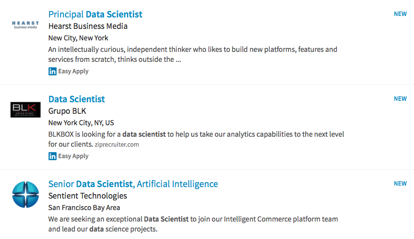
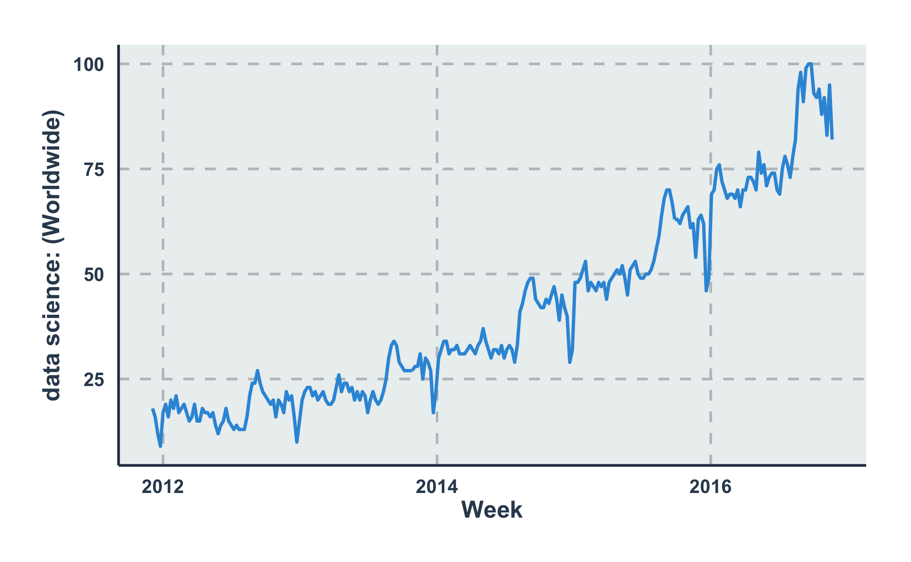
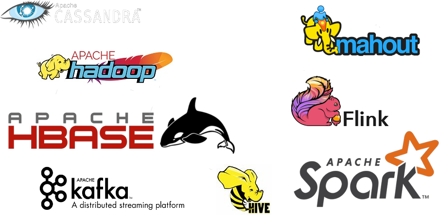
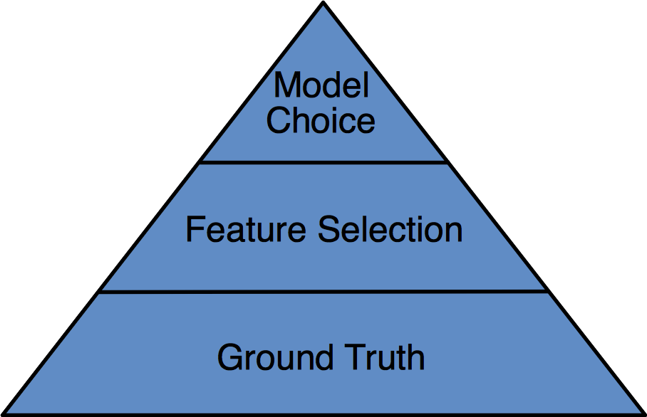
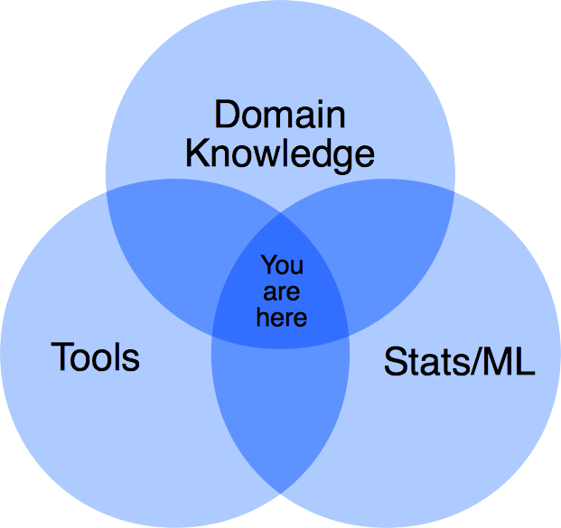

% Welcome to STK-INF4000
% Selected topics in Data Science
% Dr. Dirk Hesse

# data science?

---

# The Scientific Method

<table>
<tr>
<td>

<td>
1) **Observation**
2) Question
3) Hypothesis
4) Prediction
5) Testing
6) Analysis
</tr>
</table>

---

# Hypotesis Testing

<table style="width: 70vw"><tr>
<td>

{style="width: 20vw"}

<td>

- Sometimes hypotheses can't be tested due to **technical restrictions**.
- Consider the Higgs boson (postulated 1964, discovered 2012).

</tr></table>

---

# Why now?

---

# Moore's Law

---

# Tools

---

# Tools ... aren't everything

---

# Data Science

---

# The Idea

---

# Outline

- Python for data analysis.
    - A tour of python.
    - Visualization.
- Data sources.
    - REST APIs.
    - Public data sets.
    - Web crawling.
- More on python.
    - Machine learning.
    - Programming style.
    - Testing your code.

---

# Outline (cont.)

- Git and github.
- Strategies for dealing with big data quantities.
- Apache Spark.
- Machine Learning in Spark with sample data sets.
    - Regression.
    - Data quality and features.
    - Time series.
    - Clustering.
    - Frequent pattern mining.
    - Anomaly detection.

---

# Python For Data Science

---

# What you'll need

- Python
- pip
- virtualenv
- git

---

# Linux

    sudo apt install python
    sudo apt install python-pip
    pip install --upgrade pip
    sudo apt install git

---

# Mac

- [install Homebrew (https://brew.sh)](https://brew.sh)
- Add to ` ~/.profile` the line `export PATH=/usr/local/bin:/usr/local/sbin:$PATH`

And then:

    brew install python
    brew install git

---

    pip install virtualenv
    cd my_project
    virtualenv venv
    source venv/bin/activate
    pip install matplotlib, jupyter, nbstripout
    jupyter notebook
    deactivate

---

# Source Control

- Version control.
- Backup.
- Bug tracking.
- Progress tracking.
- Collaboration.

---

# Git

    $ cd repo_dir
    $ git init .
    $ cat << EOF >> text_file.txt
      heredoc> Here comes some text!
      heredoc> EOF
    $ git status
    $ git add text_file.txt
    $ git status
    $ git commit -m "Initial commit."
    $ git status
    $ git log
    $ nbstripout --install

---

# Homework

## Git

- Make a [github account](https://github.com).
    - Follow the instructions to [set up git][gsu].
    - Follow the instructions to [make a repository][mkr].

[gsu]: https://help.github.com/articles/set-up-git/
[mkr]: https://help.github.com/articles/create-a-repo/

## *BitBucket

- Here, you have unlimited *private* repositories.
- Make an account here as well.
- Create a repository.

---

# Homework

## Python

- Install `python`, `pip`, and `virtualenv`.
- Create a project folder and a virtual environment.
- Install `jupyter`, `matplotlib`, and `mbstripout`.
    - Active `nbstriput`.
- Head over to [google trends][gtr] and download a `.csv` file of a
  search term of your choice.
- Read the data in a notebook and make a plot.
- Create a `README.md` file and include the plot in it.

---

# Homework

## *Peak detection

- From the data, calculate 8- and 16-week averages and standard
  deviations,
    $$\mu_i^k = \frac {1}{k} \sum_{l = i - k/2 + 1}^{i + k/2} x_l,
  \quad k \in \{8, 16\}$$
    $$\sigma_i^k = \frac {1}{k} \sqrt{\sum_{l = i - k/2 + 1}^{i + k/2}
  (x_l - \mu_i^k)^2}, \quad k\in\{8, 16\}$$
- Define a threshold, e.g. $\varepsilon = 3.5$, identify those points
  where $|x_j - \mu_i^k| > \varepsilon \sigma_i^k, \quad j \in {i -
  k/2 + 1, \ldots, i + k/2}$. What can you say about those?

[gtr]: https://google.com/trends
