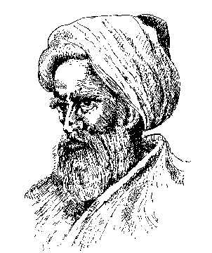

% Welcome to STK-INF3000/4000
% Selected topics in Data Science
% Dirk Hesse

# data science?

---

# The Scientific Method

<table>
<tr>
<td>

<td>
1) **Observation**
2) Question
3) Hypothesis
4) Prediction
5) Testing
6) Analysis
</tr>
</table>

---

# Hypotesis Testing

<table style="width: 70vw"><tr>
<td>

{style="width: 20vw"}

<td>

- Sometimes hypotheses can't be tested due to **technical restrictions**.
- Consider the Higgs boson (postulated 1964, discovered 2012).

</tr></table>

---

# Why now?

---

# Moore's Law

---

# Tools

---

# Tools ... aren't everything

---

# So, what does a data scientist do?

- Talk to managers, try to understand the business.
- Find room for improvements, new projects.
- Use data to implement those.
    - Plain statistics.
    - Machine learning.
    - Big data projects.
    - Lots of coding.
- Present findings, convince people to act on them.

---

# Data Science

---

# The Idea

---

# (selected) Problem domains

- Customer relationship management (CRM).
    - Churn prediction.
    - Case prioritization.
    - Campaign optimization.
- Fraud detection.
    - Credit card fraud.
    - Intrusion detection.
- Recommender systems.
- Non-profit/NGO.
    - Disaster prediction/reaction optimization.
    - Conflict analysis.
- Online-ads.
- Transportation.
    - Route optimization.
    - Traffic flow optimization.
- **Many** more.

---

# Outline

- Python for data analysis.
    - A tour of python.
    - Visualization.
- Data from the web.
    - REST APIs.
    - Crawling.
- More on python.
    - Numpy/scipy.
    - Machine learning in `scikit-learn` (maybe).
    - Programming style.
    - Testing your code.

---

# Outline (cont.)

- Git and github.
- Storing data (MongoDB and friends).
- Strategies for dealing with big data quantities.
- Apache Spark.
- Machine Learning in Spark with sample data sets.
    - Classification and regression.
    - Data quality and features.
    - Time series.
    - Clustering.
    - Frequent pattern mining.
    - Anomaly detection.
    - Streaming data.
- Publishing web data: Flask.

---

# Course Mechanics

- 3 lectures / week (Mondays, me).
- 2 computer labs (Tuesdays, Håvard Kvamme).

- Homework (voluntary).
- Project work (mandatory).

- Examination.
    - Mid-term oral exam (**30%**).
    - Final oral exam (**30%**).
    - Final written exam (**40%**).

---

# The Project

### Propose a project that involves

- Ingesting data.
- Processing data.
- Making predictions.
- Presenting the results.

### And a motivation.

- Who will use/buy it?

---

# Python For Data Science

- Why Python?
    - Easy to learn.
    - Powerful.
    - Widely spread.
    - Lots of useful packages.
- Why coding?
    - Data science means a lot of coding.
    - This code should be 'production grade'.
        - Readable.
        - Reliable.

---

# What you'll need

- Python
- pip
- virtualenv

---

# Linux

    sudo apt install python
    sudo apt install python-pip
    pip install --upgrade pip

---

# Mac

- [install Homebrew (https://brew.sh)](https://brew.sh)

And then:

    brew install python

---

    pip install virtualenv
    cd my_project
    virtualenv venv
    source venv/bin/activate
    pip install matplotlib jupyter
    jupyter notebookbu
    deactivate

---

# Homework

[https://dhesse.github.io/STK-INF4000-hw/](https://dhesse.github.io/STK-INF4000-hw/)

---

# Slack - Page

## STK-INF4000.slack.com

