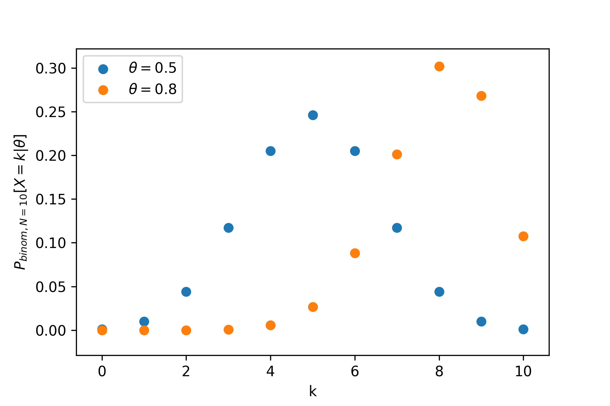
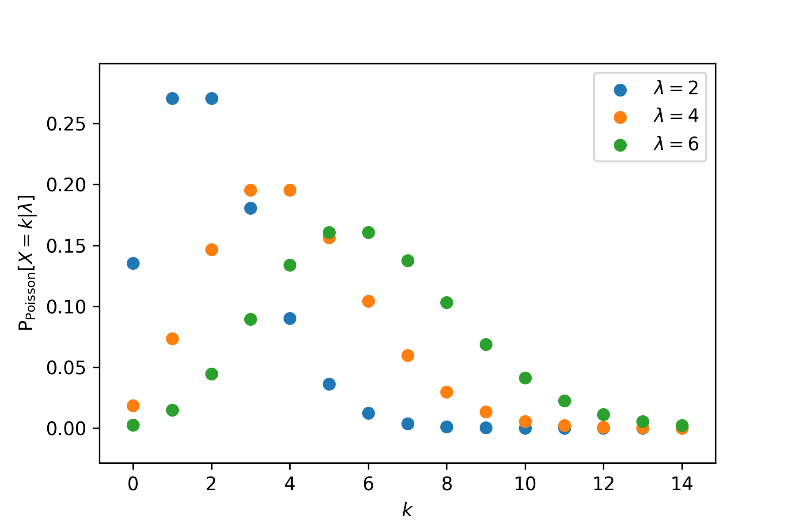
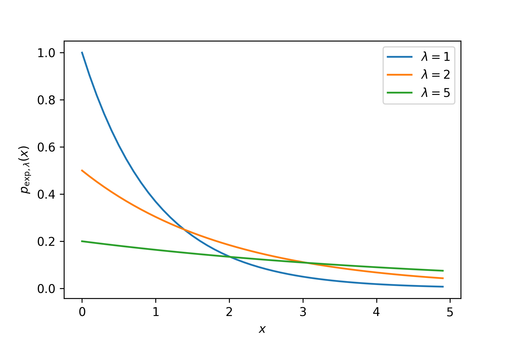
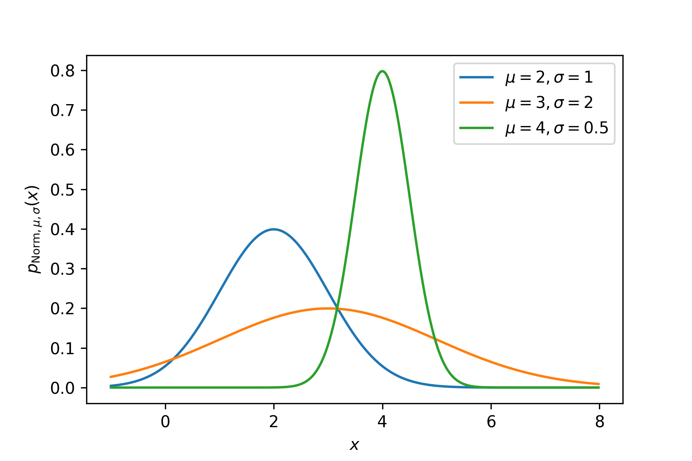

% Introduction to Machine Learning
% Dirk Hesse
% STK-INF4000, Week 4

# Machine Learning Examples

- Classify whether an email is spam or not, given the words in in it.
- Predict demand for a certain article, given past demand for similar articles.
    - How many copies of a book should we print?
    - How may gadgets do we need to stockpile?
- Predict CO2 levels today, given yesterday's levels and weather data.
- Predict relevance of a search result for a given user.
- Predict the sentiment of a product review.

$$
\newcommand{\EPE}{\operatorname{EPE}}
\newcommand{\E}{\operatorname{E}}
\newcommand{\R}{\mathbb{R}}
\renewcommand{\P}{\operatorname{P}}
\newcommand{\argmin}[1]{\underset{#1}{\operatorname{argmin}}}
\newcommand{\cA}{\mathcal{A}}
\newcommand{\Yhat}{\hat{Y}}
\newcommand{\fhat}{\hat{f}}
\newcommand{\Var}{\operatorname{Var}}
$$

---

# Rough Definition

> Machine learning makes use of computers to interpret data and find
> patterns in it, often enabling us to predict properties of instances
> of the data not yet seen.

---

# Data

- We will denote our inputs $X$, and our target $Y$.
    - *Example*: $X$ contains CO2 levels, temperature, etc. on a given
        day, $Y$ the CO2 levels the day after.
- $X$ is often a vector, $X^T = (X_1, \ldots, X_p)$.
- $Y$ is often a scalar, but could be a vector as well.

---

# Learning Task

Given examples for $X$ and $Y$, denoted

$$(x_i, y_i)\quad i = 1,\ldots,n$$

find a function that gives a reasonable (for some value of reasonable)
prediction $\hat y$ given a previously unseen sample $x$.

$x_i = \left(x^{(1)}_i, \ldots, x^{(p)}_i\right)^T$ and $y_i$ are
properties of the $i$-th example, e.g. time spent on a website and
numbers of links clicked during a visit of a specific user.

---

# Types of Data

- Continuous
   - E.g. height, CO2 concentration.
- Categorical
   - Spam (yes or no), color.
- Ordered categorical
   - High, medium, low.

---

# Types of Learning

- Supervised learning.
    - As explained.
    - Given $(x_i, y_i)$, find a function to predict $y$ given $x$.
    - Examples: Spam classification, demand prediction.
- Unsupervised learning.
    - No target $Y$.
    - Find patterns in the data.
    - Examples: Recommender systems, finding groups.

---

# What can be learned?

- $Y$ *must* be dependent on $X$.
- Dependence can be *very* complex.
    - Example: Sentiment analysis.
    - Deep learning.

---

# Some basic Probability

---

# Probability distributions

- Discrete case:
    - Probability mass function, PMF: $P[X]$
    - Example: $P[heads] = 0.5$.
- Continuous case:
    - Probability density function, PDF: $p(x)$

---

# Expectation values

### Discrete case

$$E[X] = \sum_x x\, P[X = x]$$

$$E[f(X)] = \sum_x f(x)\, P[X = x] \neq f(E[X])$$

---

# Expectation values

### Continuous case

$$E[X] = \int x \,p(x) \mathrm{d} x$$
$$E[f(X)] = \int f(x)\, p(x) \mathrm{d} x \neq f(E[X])$$
 
---

# Famous Probability Distributions

---

# Binomial

$$\mathrm P[x = k|\theta] = \binom{N}{k} \theta^k (1 - \theta)^{N -
k}$$

- Email is spam with probability $\theta$, then $P[x = k|\theta]$ is
  the probability of having $k$ out of $N$ emails spam.
- Production errors.
- Click rate.

---

---

# Poisson

$$\mathrm P[X = k|\lambda] = \frac {\lambda^k e^{-\lambda}}{k!}$$

- Events ouccuring at a rate $\lambda$.
- Radioactive decays.
- Cars arriving at intersection.
- Number of network packets arriving.

---

---

# Exponential

$$p(x) = \frac 1 \lambda e^{-\frac{x}{\lambda}},\quad x > 0$$

- Web server response time.
- Time to next earthquake.
- Time until hard drive failure.

---

---

# Gaussian / Normal

$$p(x) = \frac 1 {\sqrt{2 \pi} \sigma} e^{-\frac 1 2 \frac{(x - \mu)^2}{\sigma^2}}$$

- CO2 levels.
- Telnet session length.
- Student scores.

---

---

# Conditional Probability

Example: Study concerning income class (high, low).

        Female   Male
------ -------- ------ ------
 High     9%      11%    20%
 Low     46%      34%    80%
         55%      45%
------ -------- ------ ------

- 9%, 11%, ...: joint probabilities.
- 20%, 60%, ...: marginal probabilities.

---

## Conditional Probability

$$P(x|y) = \frac{P(x,y)}{P(y)}$$

Here, $P(High|Female) \approx 16\%$, while $P(High|Male) \approx
24\%$.

---

# What does this have to do with ML?

---

# Decision Theory - Supervised Learning

We have

- $X \in \mathbb R^p$ random input vector.
- $Y \in \mathbb R$ output vector.
- Looking for $f(X)$ predicting $Y$.

---

## Why?

---

## Prediction

- Exact form of $f$ not too important.
- Accuracy important.

---

## Inference

- Which parts of $X$ are important for predicting $Y$?
- What is the relationship between $Y$ and $X$?
- What is the *functional* relationship between them? Linear?
- **Exact form** of $f$ *is* important.

---

## How to get $f$?

- *Loss function* $L(Y, f(X))$,
    - Often $L(Y, F(X)) = (Y - f(X))^2$.
- Minimize expected prediction error.
  $$\mathrm{EPE}(f) = E(Y - f(x))^2 = \int (y-f(x))^2 p(x, y) dx\,dy$$

---

## Careful, Math!

Remember $\P(X, Y) = \P(Y|X)\P(X)$? This gives

$$\EPE(f) = \E_X\E_{X|Y}\left([Y - f(X)]^2 | X\right)$$

and thus we minimize point by point

$$f(x) = \argmin c\, \E_{Y|X} \left([Y - c]^2 | X = x\right)$$

This yields

$$f(x) = \E(Y|X = x)$$

---

# How good can we do?

- Assume $Y = f(X) + \epsilon$.
    - $\epsilon \sim N(0, \sigma)$ (normal distributed).
- Our estimate $\fhat(X) = \Yhat$: 
  $$\E(Y-\Yhat)^2 = \E[f(X) + \epsilon - \fhat(X)]^2 =
        \E [f(X) - \fhat(X)]^2 + \Var(\epsilon).$$
- We have control over $\E [f(X) - \fhat(X)]^2$.
- We have no control over $\Var(\epsilon)$.

---

## K-Nearest Neighbors

KNN implements this in a very simple way:

$$\fhat(x) = \frac 1 k \sum_{z \in N_k(x)}{z}\,,$$

where $N_k(x)$ are the $k$ closest training examples to $x$ from a
given training set.
