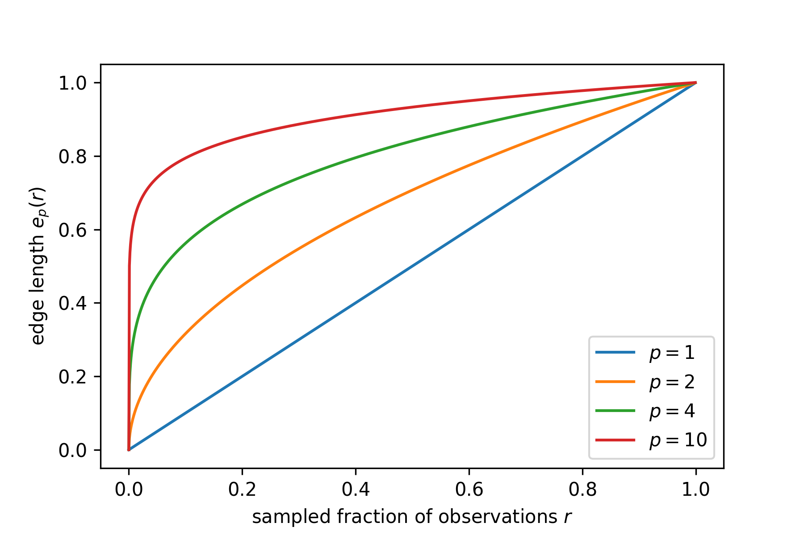
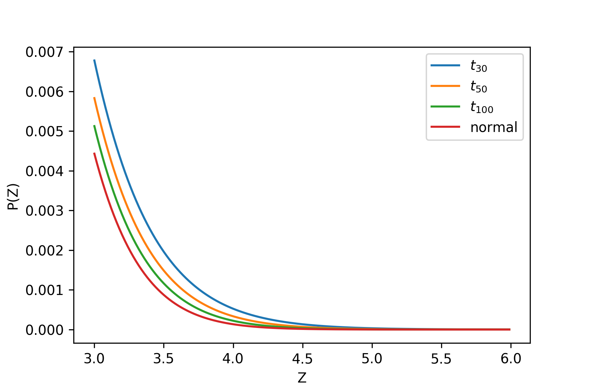

% Linear Regression
% STK-INF4000 - Week 6

# Objective

Given a vector $X = (X_1, \ldots, X_p)^T$ for random *input*
variables, find a function $f$ that predicts a given random *target*
variable $Y$ such that

$$f(x) = \operatorname E[Y | X = x]$$

from a set of *training data* $(x_i, y_i)$, with $i = 1,\ldots, n$.

---

# Where K-Nearest Neighbors Fails

- Have to have good metric
    - Assume $X_1$: *height* of a person, $X_2$: *weight* of a person.
    - What are the $k$ nearest points to $(180cm, 70kg)$?
    - Way out: *Scale* all parameters to have *zero mean* and *unit
      variance*.
- Assume observations are uniform in $p$-dimensional *unit*
  hypercube.
- Want to capture fraction $r$ of volume (and hence observations) in
  neighborhood.
- Edge length becomes $e_p(r) = r^{1/p}$.

---

## KNN becomes non-local!

---

# Linear Approximation

Linear models assume that $\operatorname E(Y|X)$ is *linear* in
$X$.

---

# Why use linear models?

- Simple.
- Interpretable.
- Often good performance, especially
    - with *sparse data*, or
    - low signal-to-noise ratio.
- Often good approximation.
 
---

# Formulation

Linear models have the form

$$f_\theta(X) = \theta_0 + \sum_{i = 1}^n \theta_i\,X_i$$

---

# How to extract the parameters?

We may again use the least squares estimate, minimizing 

$$\operatorname{RSS}(\theta) = \sum_{i = 1}^N\left(y_i - f_\theta(x_i)\right)^2$$

on our *training data*, yielding

$$\theta^* = \underset{\theta}{\operatorname{argmin}} \sum_i \left(y_i
- f_\theta(x_i)\right)^2$$

---

# Variables

The $X_i$ can be chosen from:

- Primary observable quantities (a person's height, session length,
  number of words in an email, etc.)
- Functions thereof, e.g. logarithms, squares etc.
    - From this we can build up polynomial fits, i.e.
        $$X_2 = X_1^2,\quad X_3 = X_1^3, \ldots$$
- Combinations of variables.
    - E.g. $X_3 = X_1 X_2$.
- All these still yield *linear* functions in $\theta$.

---

# Analytic solution

Writing $\theta$ as a vector and $\mathbf{X}$ as a $N\times (p+1)$ matrix
(setting the first column to 1 to accommodate for $\theta_0$), we get

$$Y = \mathbf{X}\theta$$

Minimizing $\sum_i \left[y_i - f(x_i)\right]^2 = (Y -
\mathbf{X}\theta)^T(Y - \mathbf{X}\theta)$ yields the analytic solution

$$\theta = (\mathbf{X}^T\mathbf{X})^{-1}\mathbf{X}^Ty\,.$$

---

# Caveats

- If we have *more parameters* than *training examples*, i.e. $p > N$,
  $\mathbf{X}^T\mathbf{X}$ won't have full rank. In this case the
  solution is ambiguous.
- The same is true if we have fully correlated input variables,
  i.e. $X_i = \alpha X_j$ for some fixed $\alpha$ and $i \neq j$.
- If we *scale an observable*, i.e. $\tilde X_i = \alpha_i X_i$, the RSS
  will be minimized by $\tilde \theta_i = \frac{1}{\alpha_i} \theta_i$.
- This is *vastly different* from K-Nearest neighbors, which is highly
  sensitive to scaling of the variables.
    - We've seen earlier how to partially fix this by scaling.

---

# Coefficient variance

Under the assumptions that

- $y_i$ are *uncorrelated* with constant *variance* $\sigma$
- $x_i$ are fixed

$$\operatorname{Var}(\hat \theta) = (\mathbf{X}^T\mathbf{X})^{-1}
\sigma^2\,,$$

and we can approximate

$$\hat \sigma^2 = \frac{1}{N-p-1}\sum_{i=1}^{N} (y_i - \hat y_i)^2\,.$$

---

# Z-Score

$$z_j = \frac{\hat \theta_j}{\hat\sigma \sqrt{v_j}}$$

with $v = \operatorname{diag}(\mathbf{X}^T\mathbf{X})^{-1}$ is under
the *null hypothesis* $\beta_j = 0$ distributed as a $t$-distribution
with $N-p-1$ degrees of freedom.

---

---

## Significance of groups

If we want to test for the *significance* of groups of variables, we
make two models

- model 0 does **not** contain the variables
- model 1 contains them

Then we use the F-statistic

$$F = \frac{(\operatorname{RSS}_0 - \operatorname{RSS}_1) / (p_1 -
p_0)}{\operatorname{RSS}_1 / (N - p_1 - 1)}\,,$$

which (under reasonable assumptions) has a $F_{p_1 - p0,N-p_1-1}$
distribution.

---

## The Gauss Markov Theorem

$$\operatorname{MSE}(\hat \theta) = \operatorname{E}(\hat \theta -
\theta)^2 = \operatorname{Var}(\hat \theta) +
[\operatorname{E}(\hat \theta) - \theta]^2\,.$$

Gauss-Markov: 

> The least square solution for $\theta$ has the smallest variance
> among all linear unbiased (i.e. $\operatorname{E}(\hat \theta) =
> \theta$) estimates.

This means:

> We sometimes can reduce **variance** by having a little **bias**.

---

# Subset Selection

Linear estimate often can be improved:

- Increase **accuracy** by shrinking or setting $\theta_i = 0$ to
  reduce *variance* at cost of *bias*.
- Increase **interpretability** by focusing on features with biggest
  effect.
  
---

## All subsets

For $k = 1,\ldots,p$, select out of all subsets of features of size
$k$ the one with *lowest* RSS.

- Feasible for up to $p \approx 40$.
- Only works for $N > p$.
- Will always find the best subset for a given $k$.

---

## Forward stepwise

- Start with $\theta_0$ only.
- At each step, include feature whose addition gives lowest RSS.
- Greedy algorithm.
    - Computationally effective for large $p$.
    - Works for $N < p$.
    - Often *reduces variance at cost of bias*.

---

## Backward stepwise

- Start with full set.
- At each step, eliminate feature with highest $Z$-Score.
- Only works with $N > p$.

---

# Shrinkage methods

- Add penalty for large numerical values for parameters $\theta$.
- Will reduce those not very important in model.

$$\hat \theta = \underset{\theta}{\operatorname{argmin}}
\left[\sum_i \left(y_i - f_\theta(x_i)\right)^2 + \operatorname{P}(\theta)\right]$$

---

## Ridge regression

$$P(\theta) = \lambda \sum_{i = 1}^p \theta_i^2$$

- Will typically *not* set any $\theta_j = 0$.
- Has nice analytical properties, e.g. 
  
  $$\hat \theta = (\mathbf{X}^T\mathbf{X} + \lambda
  \mathbf{I})^{-1}\mathbf{X}^T y$$

  $$\operatorname{df}(\lambda) =
  \operatorname{tr}\left\{\mathbf{X}(\mathbf{X}^T\mathbf{X} + \lambda
  \mathbf{I})^{-1}\mathbf{X}^T\right\}$$

- Relatively easy to handle numerically.

---

## Lasso

$$P(\theta) = \lambda \sum_{i = 1}^p |\theta_i|$$

- Will often set some $\theta_j = 0$.
- A bit more difficult analytically and numerically.
- Efficient numerical implementations exist (e.g. `scikit-learn`).

---

## Elastic Net

$$P(\theta) = \lambda \sum_{i = 1}^p \left[ \alpha \theta_i^2 +
(1-\alpha) |\theta_i|\right]$$
