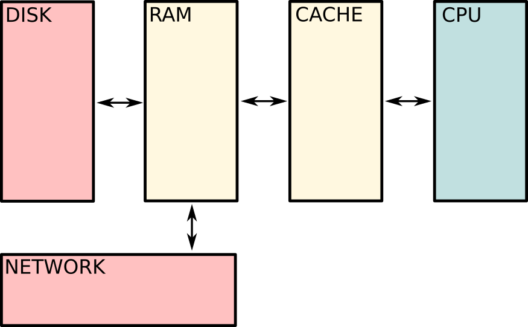
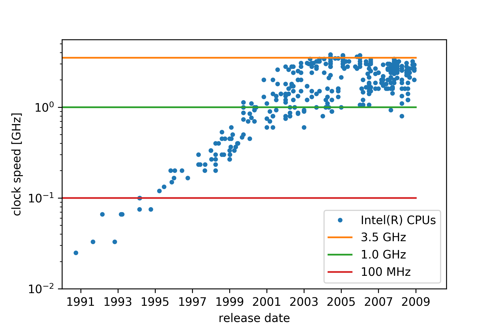
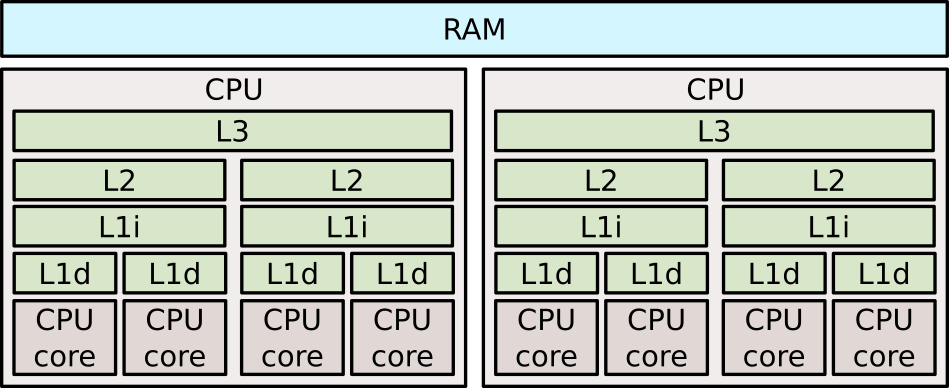
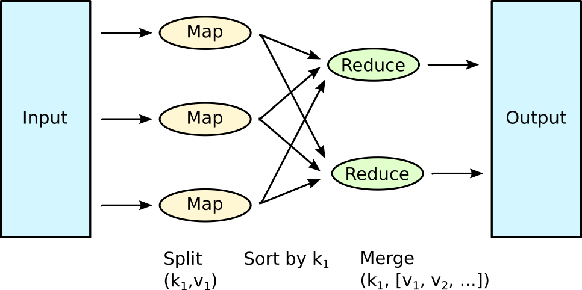
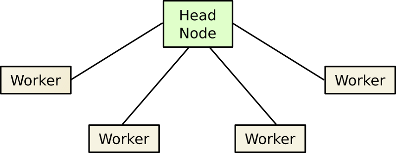

% Dealing With Big Data Quantities

# Big data quantities?

We're talking several dozen to several 100 TB.

---

### Example: AWS instances for rent

### X1.32xlarge (Feb. 2017)

- 128 CPUs
- 1 952 GB of RAM
- 2 x 1920 TB SSD
- approx. 130 NOK/hour

---

## How does a computer work anyway?

---

# Data flow in your computer

---

# Interesting properties

- **Latency**
    - How fast can data be accessed?
- **Bandwidth**
    - How much data per second can be transferred?
- **Size**
    - How much data can be stored?

These vary by *orders of magnitude*.

---

# Latencies

Time       Event          Equivalent
-------    -------------  -----------------------------------------
1ns        L1 cahce ref.  Human blink (150ms).
3ns        Branch mispr.  Light travels around the world twice.
4ns        L2 cache ref.  Arrow travels 50m (0.6s).
100ns      RAM ref.       Usain Bolt runs 150m (15s).
2$\mu$s    Zip 1KB        Make a coffe (5 min).
16$\mu$s   SSD read       Watch 2 episodes of Seinfeld (40m).
500$\mu$s  Net DC<->DC    Watch all LOtR movies twice (20h).
3ms        Disk seek.     Watch all James Bond movies twice (5d).
150ms      Net CA<->NL    Take STK-INF4000 twice (8.5 months).
-------    -------------  -----------------------------------------

---

### Sizes and Bandwidths (Haswell Mobile)

Medium             Size   Bandwidth
---------      --------  ----------
Level 1 Cache   128 KiB   700 GiB/s
Level 2 Cache     1 MiB   200 GiB/s
Level 3 Cache     6 MiB   100 GiB/s
RAM              16 GiB    10 GiB/s
SSD             500 GiB    600 MB/s 
Ethernet                    13 MB/s
Wifi                       1.4 MB/s
---------      --------  ----------

---

# Why not use a single CPU?

---

## CPU Clock Speeds

---

## The Ugly Truth

---

## Parallelize the work

- Multiprocessing / Threading
     - Operate with multiple CPUs/cores on same memory.
- Cluster computing (i.e. Cray, Blue Gene)
     - Have multiple machines work on the same problem.
     - Communicate via network (slow).
     - Usually used for scientific simulations (fluid dynamic, quantum
       chromodynamics)
         - Tend to be communication intensive.
- Low-cost commodity hardware clusters.
     - Things break easily.
     - Communication not as efficient.
     - Cheap.

---

## Multiprocessing

- Needs synchronization between threads.
- Needs coordination of memory accesses.
- Done automatically in some `numpy` backends.
    - And hence in `scikit-learn`.
- Manually: `multiprocessing`.
    - Will keep track of synchronization/coordination for you.

---

## Cluster computing

- In the data science world: MapReduce.
- In other fields: MPI.

We won't talk about MPI here.

---

## MapReduce

---

## MapReduce

- Ingredients
    - **Mapper**: A touring machine $\mu$ accepting a key-value pair
      $(k,v)$ and produces a *list* of key-value pairs $(\kappa_1,
      \nu_1), \ldots, (\kappa_n, \nu_n)$.
    - **Reducer**: A touring machine $\rho$, accepting a key $k$ and a
      list of values $(v_1, \ldots, v_n)$ and producing as output the
      same key $k$ and a new list of values $(\nu_1, \ldots, \nu_m)$.
- Algorithm
    - For a list of input pairs $(k_i, v_i), \ldots, (k_N, v_N)$ apply
      the mapper $\mu$ to all of them.
    - For each given output key $k$, collect the list of values
      $(v_{k,1}, \ldots, v_{k,N_k})$ produced by $\mu$.
    - Apply a reducer to each of those in parallel.
- The algorithm can be iterated of many pairs of mappers and reducers.

---

## Reduce

- Often reduce is required to be *associative*, so reduce inputs can
  be shuffled through the cluster. Schematically:
  $$\rho(k, [v_{k,1}, \ldots, v_{k, n}]) = \rho\left\{k, \rho(k, [v_{k,1}, \ldots,
  v_{k, s}]) \oplus \rho(k, [v_{k, s+1}, \ldots, v_{k, n}])\right\}$$
- Reduce calls can then be executed in parallel.

---

## A MapReduce Cluster

---

## What's the fuss?

Google managed to sort 1 *petabyte* of data ...

... in **hours** ...

... in **2011**!

---

## Implementation

- Practical implementations take care of
    - Parallelization
    - Communication
    - Data distribution
    - Data collection
    - Node failure
- Most used/known implementation
    - Apache Hadoop
        - Comes with `hdfs`, a *distributed file system*.

---

## Apache Spark

- In-memory MapReduce.
- Data processing.
- Machine learning.
- Streaming.
- Used to sort 100TB in 23 minutes.
    - Using 207 machines on EC2 (2014).
- Used to sort 100TB for $1.44/terabyte (2016).
