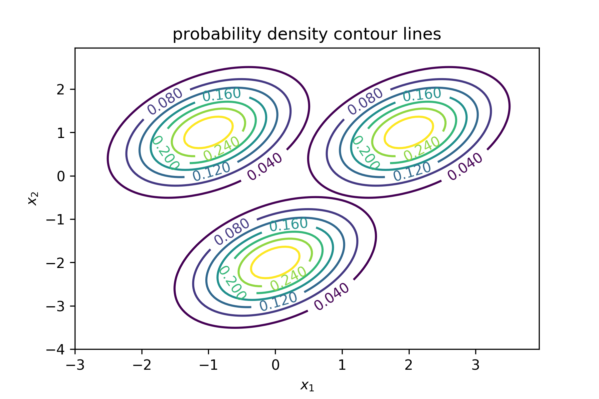
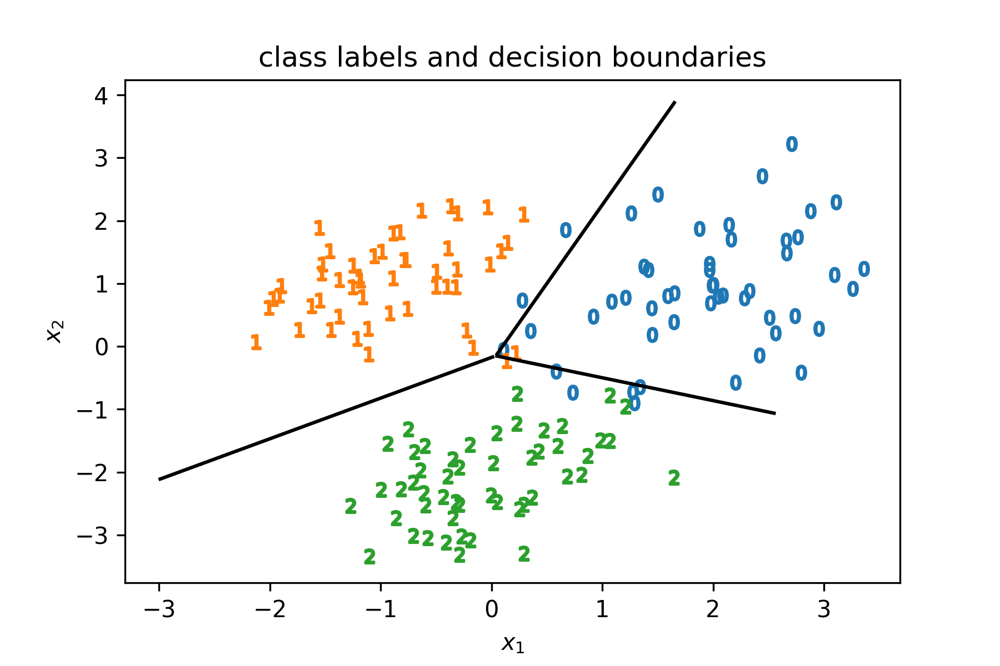
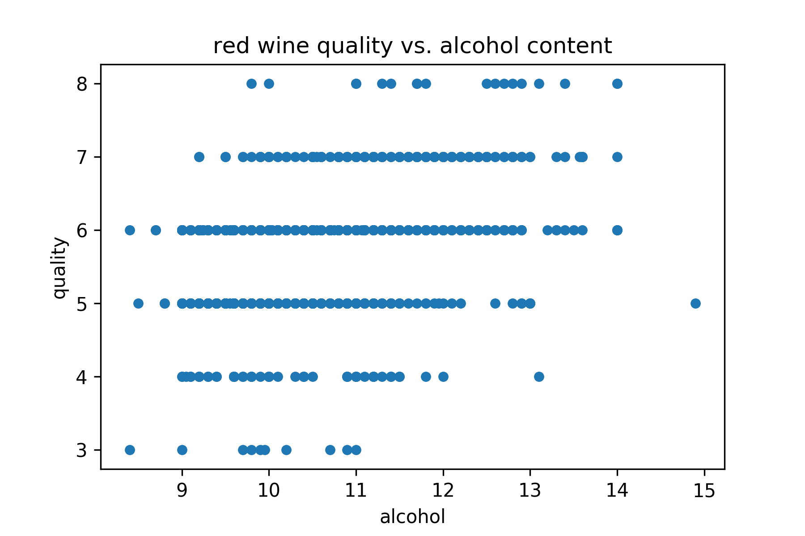
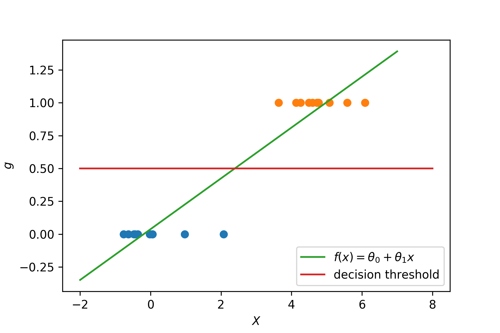
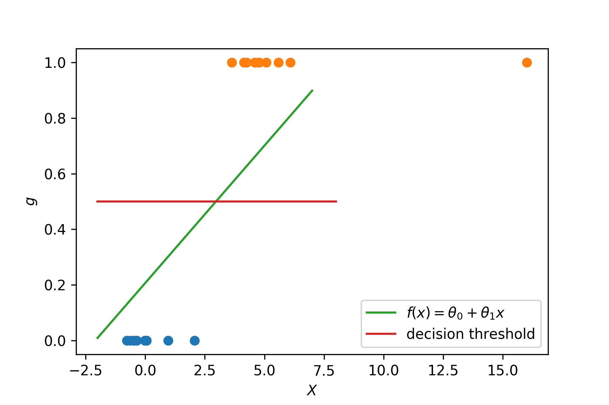
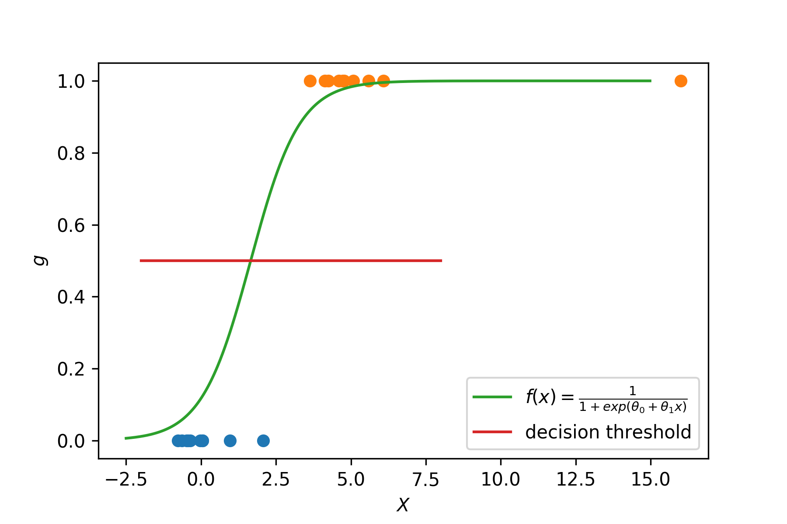
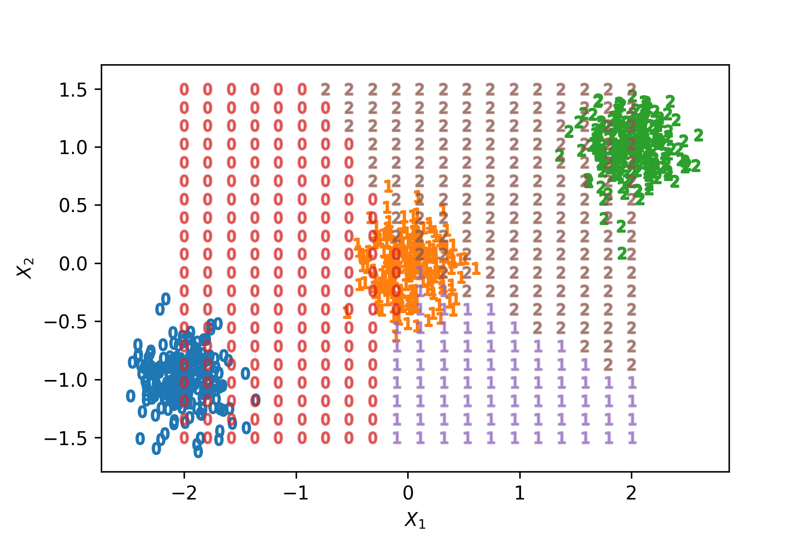
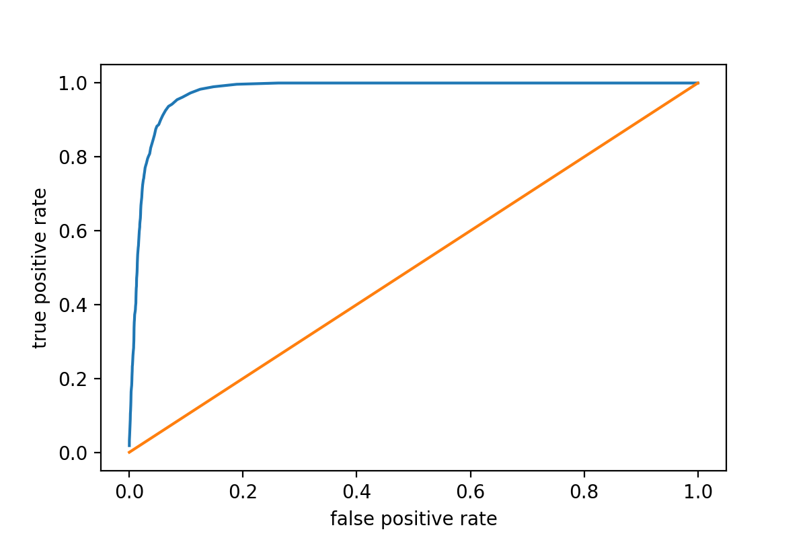

% Classification

# Examples

- Binary Classification
    - Is email spam or not?
    - Is credit card transaction fraudulent?
    - Is a user male or female?
- Multi-level classification
    - Safety standard of a car.
    - Activity is associated with acceleration data from smartphone.
    - What kind of flower is shown in a picture?

---

# The classification problem

- Given
    - $X = (X_1, \ldots, X_p)^T$ random *input* variables.
    - Output variable $G$, taking values in set $\mathcal G$ with $k$
      different values, labeled $1,2, \ldots, K$.
- Task
    - Given a training set $(g_i, x_i), i = 1,\ldots,N$
    - Find a good approximation for $G(x) = \operatorname{E}(G|X = x)$
    - Usually among the lines of maximizing $\sum_i \log
      \Pr[G = g_i| X = x_i; \theta]$, where $\theta$ are model
      parameters.

---

# Decision boundaries

Decision boundaries are *hypersurfaces* where

$$\{x \left| \operatorname{Pr}(G = k| X = x) = \operatorname{Pr}(G =
l| X = x)\right.\}.$$

---

# Linear classification

The classification problem is linear if the decision boundaries
between any two classes $k, l$,

$$\{x \left| \operatorname{Pr}(G = k| X = x) = \operatorname{Pr}(G =
l| X = x)\right.\}$$

are *linear* in $x$.

---

# Discriminant Functions

- Popular approach.
- Define *discriminant functions* $\delta_k(x)\, k = 1,\ldots,K$.
- Classify to $G(x) = \operatorname{argmax}_k \delta_k(x)$.
    - Could e.g. model $\operatorname{Pr}(G = k | X =x)$ directly.
- Decision boundaries are *linear* in $x$ if $\delta_k(x)$ are.
- The same holds true for $\operatorname{Pr}(G = k | X =x)$.

---

# Example: Multivariate Normal

$$f(x) = \frac{\operatorname{exp}\left(- \frac 1 2 (x -
\mu_l)^T\Sigma^{-1}(x - \mu_l)\right)}{\sqrt{(2 \pi)^d |\Sigma|}}$$

---

# Densities

---

# Linear boundaries

---

# Actually ...

... it's enough to have

$$\left\{ x \left|\, f(\operatorname{Pr}[G = k | X = x]) = f(\operatorname{Pr}[G =
l | X = x])\right.\right\}$$

linear in $x$ / a hyperplane / affine space for some *monotone* $f$.

### Example

$$\operatorname{log}\left( \frac{\operatorname{Pr}[G = k | X = x]}{\operatorname{Pr}[G =
l | X = x]}\right) = \theta_0 + \theta^T\,x$$

---

# Variables

- Of course we can still have $X_i = X_j^2$ or $X_i = X_k\,X_l$.
- Decision boundaries can still be seen as linear in new variables.

---

# Categorical input data

- *Naïve approach*: Convert to numeric.
    - Generally bad idea.
    - Defining a metric on categoricals tricky.
- *Usual approach*: One-hot encoding.
    - For a $K$-level categorical, introduce $K-1$ new variables $X_1,
      \ldots, X_k$, 
      $$x_i = \begin{cases} 1 &\mbox{if } g_i =
      k\\0&\mbox{else}\end{cases}$$
    - Effect of $k$-th variable is the effect of having $g_i = k$
      instead of $g_i = K$.

---

# Training data

- Need to make sure all *classes* are represented.
- What if one (or more) classes are over-represented?
    - Different priors?
    - Data collection artifact?
    - Re-balance training data?

---

# Ordered Targets

- What if we have ordered categoricals?
- Sometimes a bit of a moving target ...

---

# Red Wine Quality

---

# Categorical or not?

- *Pros*
    - Don't have to think (too much) about metric.
    - Don't have to think (too much) about subjectivity.
- *Cons*
    - Using e.g. linear regression, you can answer
        - How many quality points per additional per cent alcohol do
          we earn?
    - Information about order is lost.
    - Sometimes gives less variance.

---

# Methods

---

# Linear Regression

- Write an indicator variable $Y = (Y_0, \ldots, Y_K)$.
    - $Y_l = \begin{cases}1 &\mbox{if } G =
      l\,,\\0&\mbox{else.}\end{cases}$
- Fit a linear model
  $$\hat f_l = \hat \theta_{0,l} + \hat \theta_lx^T.$$
  to each $Y_l$
- Classify $\hat G(x) = \operatorname{argmax}_{k\in\mathcal
  G}\hat f_k(x).$
- Can have disastrous results.

---

---

---

---

---

# Linear Discriminant Analysis

Use Bayes' theorem

$$\begin{align}\operatorname{Pr}(G = l | X = x) &=
\frac{\operatorname{Pr}(X = x|G = l) \operatorname{Pr}(G =
l)}{\operatorname{Pr}(X = x)}\\
&= \frac{f_l(x)\pi_l}{\sum_m f_m(x)\pi_m}\,.\end{align}$$

---

## How to model the joint distribution?

The choice of $f_l$ determines whether LDA is in fact linear.

### LDA

$$f_l(x) \propto \operatorname{exp}\left(- \frac 1 2 (x -
\mu_l)^T\Sigma^{-1}(x - \mu_l)\right)$$

### QDA

$$f_l(x) \propto \operatorname{exp}\left(- \frac 1 2 (x -
\mu_l)^T\Sigma_l^{-1}(x - \mu_l)\right)$$

---

## Computing LDA

$$\begin{align}
\hat \pi_l &= \frac{N_l}{N}\\
\hat \mu_l &= \frac 1 {N_l} \sum_{i, g_i = l} x_i\\
\hat \Sigma &= \frac 1 {N - K} \sum_l \sum_{i, g_i = l} (x_i - \hat \mu_l)(x_i -
  \hat \mu_l)^T\\
\hat \Sigma_l &= \frac 1 {N_l - 1} \sum_{i,g_i = l}(x_i - \hat \mu_l)(x_i -
  \hat \mu_l)^T
\end{align}$$

---

## Discriminant functions for LDA

One can now use

$$\delta_k(x) = x^T\Sigma^{-1}\mu_k - \frac 1 2
\mu_k^T\Sigma^{-1}\mu_k + \log \pi_k$$

or

$$\delta_k(x) = - \frac 1 2 \log |\Sigma_k| - \frac 1 2 (x -
\mu_k)^T\Sigma_k^{-1}(x - \mu_k) + \log \pi_k$$

to classify

$$G(x) = \operatorname{argmax}_k\,\delta_k(x)\,.$$

---

# Some words on QDA

- Using $\Sigma_l$ does **not** yield linear decision boundaries.
- What if we have one class $l$, such that $X_i = 0$ for all $i$ such
  that $g_i = l$?
- Won't be able to compute $\Sigma_l^{-1}$!
- Has many more parameters
    - LDA $(K - 1)(p + 1)$
    - QDA $(K-1)(p(p+3)//2 + 1)$

---

# Regularized Discriminant Analysis

In some cases (one example: incomplete rank of $\Sigma_k$), it can be
beneficial to use

$$\hat \Sigma_k(\alpha) = \alpha \hat \Sigma_k + (1-\alpha)\hat
\Sigma, \quad 0 \leq \alpha \leq 1\,.$$

The regularization

$$\hat \Sigma(\gamma) = \gamma \hat \Sigma + (1-\gamma)\sigma^2I$$

is also sometimes used.

---

# Why should you use LDA?

### Pros

- Simple.
- Fast.
- Powerful.
- Stable.

### Cons

- No confidence intervals.
- More work to get predictor importance.

---

# Logistic Regression

Model posteriors via linear functions in $x$

$$\begin{align}
\operatorname{log}\left( \frac{\operatorname{Pr}[G = 1 | X = x]}{\operatorname{Pr}[G =
K | X = x]}\right) &= \theta_{10} + \theta_1^T\,x\\
\operatorname{log}\left( \frac{\operatorname{Pr}[G = 2 | X = x]}{\operatorname{Pr}[G =
K | X = x]}\right) &= \theta_{20} + \theta_2^T\,x\\
\ldots\\
\operatorname{log}\left( \frac{\operatorname{Pr}[G = K-1 | X = x]}{\operatorname{Pr}[G =
K | X = x]}\right) &= \theta_{(K-1)0} + \theta_{K-1}^T\,x\\
\end{align}
$$

---

# Logistic Regression

This gives us

$$\begin{align}
\operatorname{Pr}(G = k| X = x) &= \frac{\exp\left(\theta_{k0} +
\theta_k^T\,x\right)}{1 + \sum_{l=1}^{K-1} \exp\left(\theta_{l0} +
\theta_l^Tx\right)}, \quad k = 1,\ldots,K - 1,\\
\operatorname{Pr}(G = K| X = x) &= \frac{1}{1 + \sum_{l=1}^{K-1} \exp\left(\theta_{l0} +
\theta_l^Tx\right)}
\end{align}
$$

---

## How to extract the parameters?

Maximum likelihood estimation with

$$l(\theta) = \sum_{i=1}^N\log \operatorname{Pr}(G = g_i|X = x_i;
\theta)\,,$$

Find $\theta$ using

$$\theta = \underset{\theta}{\operatorname{argmax}}l(\theta)$$

via e.g. the Newton-Rhapson method

$$\theta_{\mbox{new}} = \theta_{\mbox{old}} -
\left(\frac{\partial^2l(\theta)}{\partial \theta \partial
\theta^T}\right)^{-1} \frac{\partial l(\theta)}{\partial \theta}$$

---

# Evaluation of binary classifiers

- True positive (TP)
    - Predicted 1, actually 1.
- True negative (TN)
    - Predicted 0, actually 0.
- False positive (FP)
    - Predicted 1, actually 0.
- False negative (FN)
    - Predicted 0, actually 1.

---

# Objectives

- Sensitivity (true positive rate, hit rate, recall)
    - $TPR = TP / P = TP / (TP + FN)$
    - Want to optimize e.g. for tests for disease.
    - Similarly: $FPR = FP / N = FP / (TN + FP)$.
- Specicifity (true negative rate)
    - $TNR = TN / N = TN / (TN + FP)$
    - Want to optimize e.g. in credit risk.
- Precision (positive predictive value)
    - $PPV = TP  / (TP + FP)$
    - Want to optimize this e.g. for credit card fraud.

---

# ROC

The receiver operating characteristic plots $TPR$ vs. $FPR$.

---

# AUC

The area under the (ROC) curve (AUC) is a scalar value for some
measure of model quality (for some value of quality).
