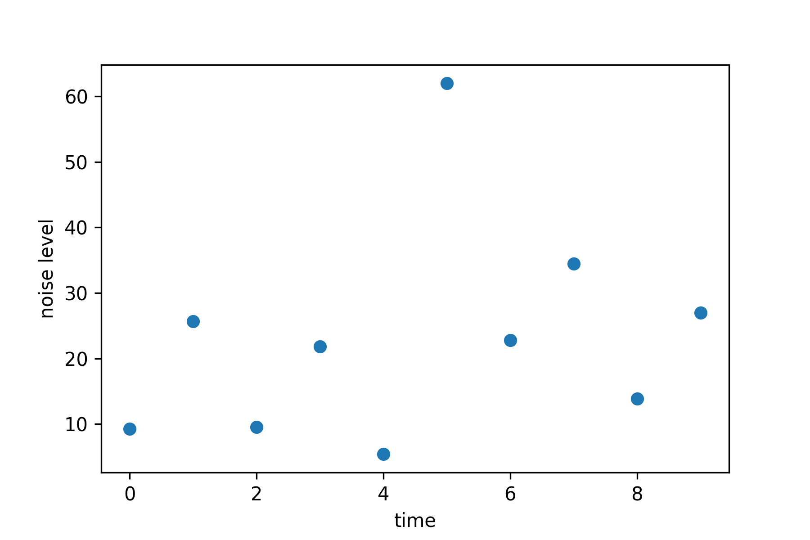
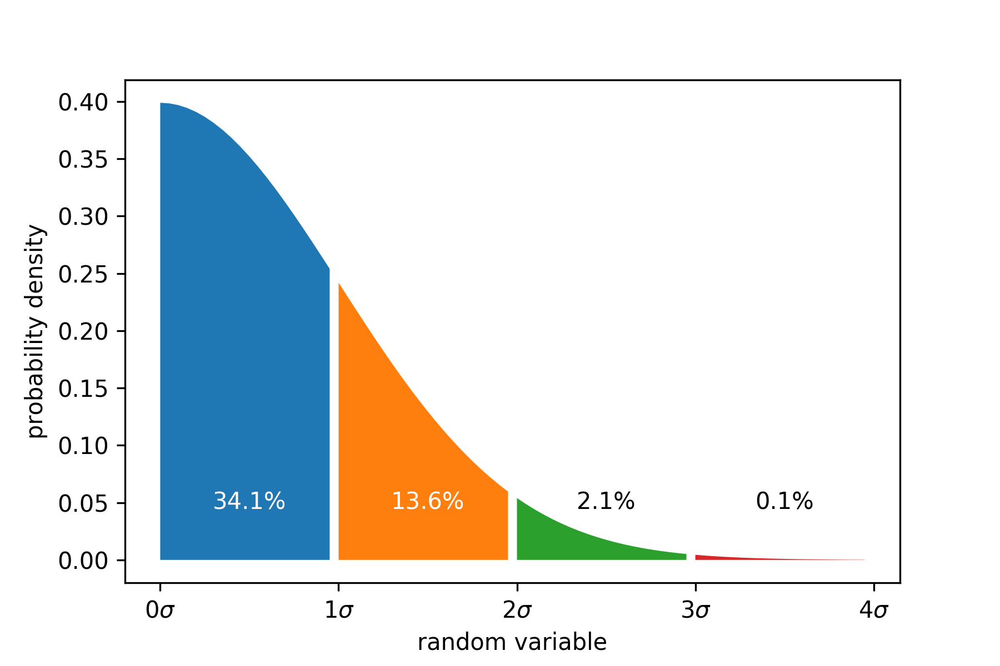
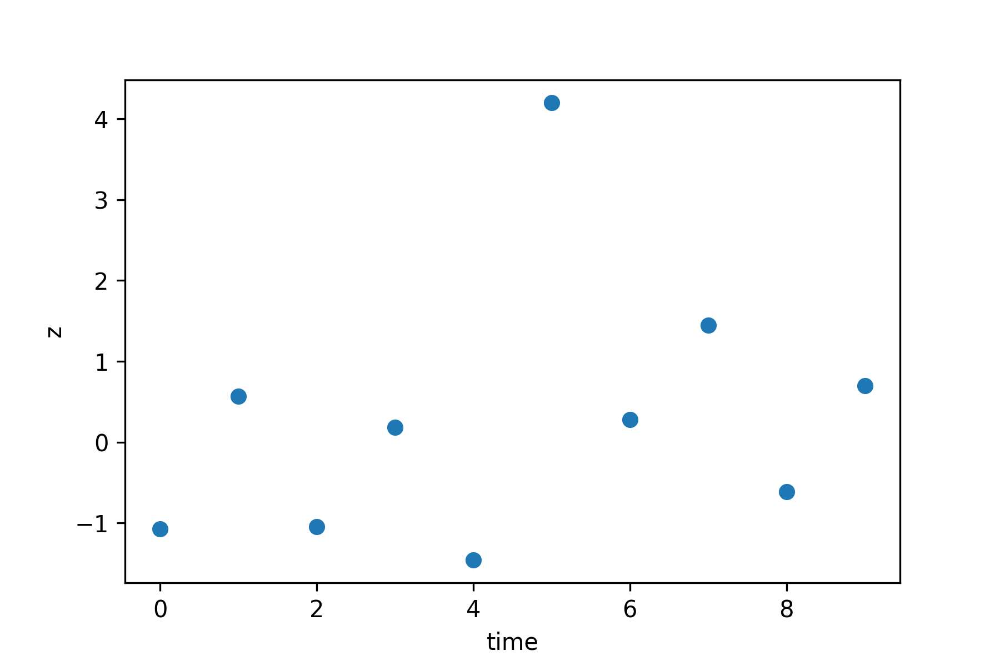
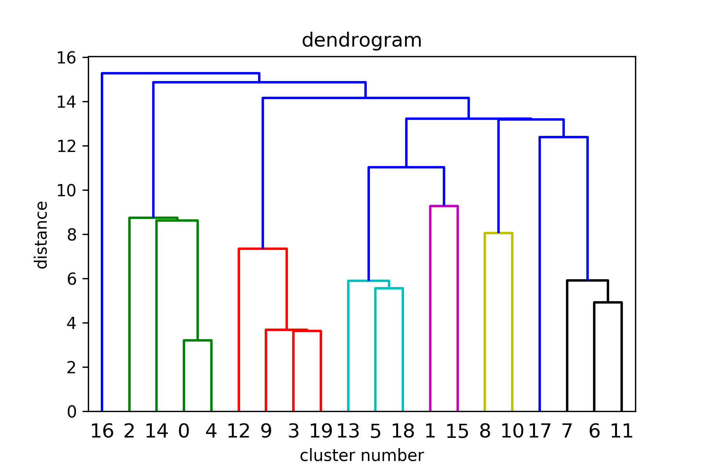
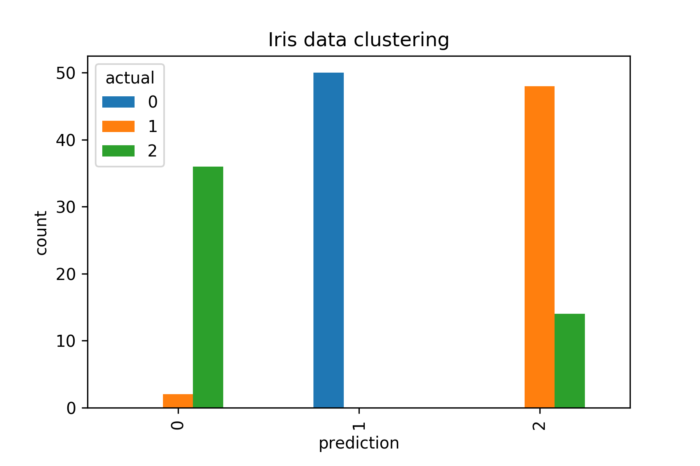

% Week 9: Anomaly Detection
% STK-INF 3000/4000
% Dirk Hesse

# Anomaly Detection

---

### Examples

- Detect if a credit card was stolen.
- Detect if a account has been hacked.
- Detect if a piece of equipment functions normally.
    - Predicting hard disk failures.
    - Predicting plane engines about to break.
    - Detect production errors.
- Detect if a insurance claim is fraudulent.

---

## Types of anomaly detection.

- Expert systems.
- Statistical anomaly detection.
- Network analysis.

---

## Expert Systems

- A lot of *if* - *then* rules.
    - If the vibration of an engine increases and the temperature
      sinks, ring an alarm.
    - If a stock price went down by more than a standard deviation in
      a week, short it.
- Used a lot in the past.

---

## Why rules fail...

- Rigid.
- Hard to maintain.
- Hard to explain.
- Will only find what you're looking for.

---

# Anomaly Detection

---

## Unsupervised Learning

- Anomaly detection uses (usually) unsupervised learning.
- Have a bunch of $x_i$, no target.
    - Cases of fraud might be unknown.
    - Or too rare to make a good predictor.
- Try to make sense of the $x_i$.
    - Usually means finding an approximation of $p(X = x)$ given the
      training data.
    - Gives a measure how improbable the observation is.

---

### Example: Predicting machine malfunction.

---

## The Normal Distribution

---

## The z Value

- Assume we have data $x_1,\ldots,x_N$.
- Calculate the mean $\overline x = \frac 1 N \sum_i x_i$.
- Calculate the standard deviation $\sigma = \sqrt{\frac{1}{N} \sum_i (x_i - \overline x)^2}$
- Calculate the z-value $z_i = (x_i - \overline x) / \sigma$.
- Flag everything with $z > z_\mbox{max}$ as anomaly.

---

## Chebyshev's inequality

- Valid for a wide variety of *probability distributions*.
- Statement:
  $$Pr(|X - \mu| \geq k \sigma) \leq \frac 1 {k^2}$$
- I.e. looking at $z$ values for anomaly detection makes sense.

---

## Sigmas and Probabilities

For the normal distribution:

Threshold  Fraction Outside
---------  ----------------
3$\sigma$  1 / 370
4$\sigma$  1 / 15 787
5$\sigma$  1 / 1 744 278
6$\sigma$  1 / 506 797 346
---------  ----------------

---

### Chebyshev guarantees

Threshold  Percent Outside
---------  ----------------
3$\sigma$    11.1111%
4$\sigma$    6.25%
5$\sigma$    4%
6$\sigma$    2.7778%

---

### Example: Predicting machine malfunction.

---

## Multidimensional Data

Can fit a multivariate normal distribution

$$f(x) = \frac{\operatorname{exp}\left(- \frac 1 2 (x -
\mu)^T\Sigma^{-1}(x - \mu)\right)}{\sqrt{(2 \pi)^d |\Sigma|}}$$

$$\begin{align}
\mu &= \frac 1 {N} \sum_i x_i\\
\Sigma &= \frac 1 {N - 1} \sum_i (x_i - \mu)(x_i -
  \mu)^T.
\end{align}$$

Flag everything with $f(x) < \epsilon$ as anomaly.

---

## The Need For Clustering

- There might be natural variations in data.
    - Weekend vs. weekday spending patterns.
    - Heart rhythms at rest vs. during sport.
- Fit a bunch of (multivariate) normal distributions.
    - How? We generally don't have labels.
- Enter: Cluster methods.

---

# Clustering

---

## Clustering 101

- Needed: Some measure for distance between measurements.
    - I.e. a metric.
- Objective: Find $k$ clusters of points that are close together.
    - Some methods find $k$ automatically.
    - Most methods need it as input.

---

## Types of Clustering

- Hierarchical
    - Arranges samples in a hierarchy, according to distance.
    - Types:
        - Agglomerative (bottom-up)
        - Divisive (top-down, not terribly common)
- Non-hierarchical
     - Examples:
         - K-Means.
         - DBSCAN.

--- 

## Agglomerative Clustering

- Start with each $x_i$ defining its own cluster.
- At each step, merge the closest two clusters.
    - Closest according to linkage you've chosen.
- Keep going until you have only one cluster.
- Choose a place to 'cut' the resulting tree.

---

## Agglomerative Clustering

---

## Distance between two clusters?

- Linkage
    - Single (closest points of clusters).
    - Full (furthest points of clusters).
    - Average (average distance of points).
    - Centroid (distance of cluster centers).

---

## How to find the number of clusters?

- Sometimes given.
    - Want to distribute customers to $k$ service people.
- Sometimes can be 'eyeballed' by looking at the dendrogram.
- Sometimes we need to work a little.
    - Number of classes might be unknown.
    - Might be questionable if there is structure at all.

---

## Preparations for finding k numerically.

- Given clustering with $k$ cluster centers $\mu_l$.
- Assign each $x_i$ a cluster $C(x_i)$, such that
  $$C(x_i) = \operatorname{argmax} \|x_i - \mu_{C(x_i)}\|$$
- For agglomerative clustering we'll often have the $C(x_i)$ first and
  calculate
  $$\mu_l = \frac 1 {N_l} \sum_{i; C(x_i) = l}x_i$$
- Define the inertia (or within-cluster RSS)
  $$\sum_l \sum_{i; C(x_i) = l} \|\mu_l - x_i\|^2$$

---

## Finding k numerically.

- Set a range $k$ you want to explore.
- Calculate the inertia for each of them.
- Plot vs. $k$.
- Often you'll see a knee-shape.
    - Less clusters than optimal: High reduction in variance.
    - More clusters than optimal: Don't gain much.
- Choose $k$ at or close to 'knee'.

---

## K-scan for the iris data set.

---

## How do you know you did well?

- Inspect per-cluster means of $X^{(i)}$.
    - Do they separate well?
- Inspect known labels.
    - Do we classify correctly?
    - Beware of cluster label mismatch.

---

## Evaluating the iris clusters.

---

## K-Means Clustering

- Start with $k$ *random* cluster means $\mu_l$.
- Given the data $x_i$, calculate new cluster centers, again using
  $$\begin{align}
      C(x_i) &= \operatorname{argmax} \|x_i - \mu_{C(x_i)}\|\\
  \mu_l' &= \frac 1 {N_l} \sum_{i; C(x_i) = l}x_i\end{align}$$
- Iterate until the assignment stops changing.

---

## Pros and Cons

- K-Means
    - Fast ($O(N^2)$).
    - Good for sphere shaped clusters.
    - Some randomness.
        - Starts with random center assignments.
        - Outcome might vary from run to run.
- Hierarchical clustering.
    - Slower ($O(n^2)$).
    - Works well with any cluster shape.
    - Can eyeball $k$ from dendrogram.

---

## Practical Considerations

- Needs a good metric.
- Observations might need to be standardized.
- Metric chosen might be of interest.
    - 1-Norm (aka Manhattan distance).
    - $l$-Norm (usually Euclidean).

---

## Clustering for fraud detection

- Calculate the per-cluster standard deviation
  $$\sigma_l = \sqrt{\frac 1 {N_l} \sum_{i; C(x_i) = l} \|x_i -
  \mu_l\|^2}.$$
- And the per-cluster $z$-value
  $$z_i = \frac{x_i - \mu_{C(x_i)}}{\sigma_{C(x_i)}}.$$
- Classify points as an **anomaly** if
  $$z_i > z_\mbox{max}.$$

---

# Questions?

