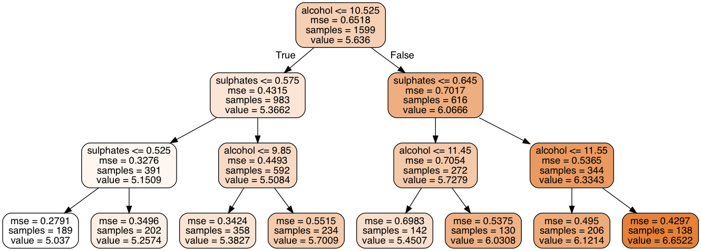

% STK-INF3000/4000 - Week 10 - Trees

## Wine Quality

---

## Wine Quality Tree

---

## Wine Quality Regression Tree

---

## Why trees?

- Simple.
- Easy to explain.
    - Especially to non-experts.
- Powerful.

---

## Calculating Trees

- Divide your data $R_L(j,s) = \{X | X^{(j)} \leq s\}$, 
  $R_R(j, s) = \{X | X^{(j)} > s\}$.
- Find the best $a_R, a_L, j, s$ to minimize
   $$ \sum_{i, x_i
      \in R_{L}(j, s)}  (a_L - y_i)^2 + \sum_{i, x_i \in R_{R}(j, s)} 
      (a_R- y_i)^2$$
- For given $j, s$, we find that $a_{R,L} = \underset{i, x_i \in
  R_{R,L}}{\operatorname{avg}} y_i$.
- Repeat on the sub-sets.
    - Until a maximum depth is reached.
    - Until a minimum number of samples is reached.

---

# Regression Tree

Our resulting model reads

$$\hat f(X) = \sum_m c_m I\left\{ X \in R_m \right\}.$$

Hence trees are an example of a general class of *additive models*.

---

## Tree Vs Linear Regression

---

## How Deep Should You Go?

- Deep trees have many degrees of freedom and hence high **variance**.
- Too shallow trees can't capture the *shape* of the data.
    - Hence have high **bias**.

---

### Bias-Variance Trade-off for Trees

---

## Training and Test Error

---

## The Best Tree

---

### Trees for Classification

Just *modifying* our tree formulas to use the **mode**

$$a_{R,L} = \underset{i, x_i \in R_{R,L}}{\operatorname{mode}} y_i$$

yields a classification algorithm.

---

### How Find the Splits for Classification?

Define

$$\hat p_{mk} = \frac 1 {N_m} \sum_{i; x_i \in R_m} I(y_i = k),$$

such that $k(m) = \operatorname{argmax}_k\hat p_{mk}$

- Misclassification: $1 - \hat p_{mk(m)}$.
- Gini index: $\sum_{k=1}^K \hat p_{mk}(1 - \hat p_{mk})$.
- Cross-entropy: $-\sum_{k = 1}^K \hat p_{mk} \log \hat p_{mk}$.

---

### Two-Class impurity Measures

---

### Tree pruning

- Stopping criteria:
    - Depth $d$.
    - Terminal node size.
    - Maximum split size.
    - Minimum impurity.
- Stopping at given $d$ or impurity threshold might miss good splits
  later on.
- Often better to stop at e.g. minimal node size 10.
- Prune resulting tree.

---

## Pruning by complexity

- Fitted tree $T_0$, let $T$ be subtree with $|T|$ terminal nodes
  $R_m$.
$$\begin{align}
N_m =&\, |\{x_i \in R_m\}|\\
\hat c_M =&\, \frac 1 {N_m} \sum_{x_i \in R_m} y_i\\
Q_m(T) =&\, \frac 1 {N_m} \sum_{x_i \in R_m}(y_i - \hat c_m)^2\\
C_\alpha(T) =&\, \sum_{m=1}^{|T|}N_m Q_m(T) + \alpha |T|
\end{align}$$

- For each $\alpha$, $\exists$ unique smallest subtree minimizing
  $C_\alpha$.

---

## Practical considerations.

- Categorical inputs.
    - *Many* possible splits.
    - Easy for binary targets.
- Loss matrix.
    - $L_{kl}$ loss for classifying $k$ as $l$.
    - Classify $k(m) = \operatorname{argmin}_k\sum_lL_{lk}\hat
      p_{ml}$.
- Missing values.
- Multiple child nodes.
- Smoothness.
- Variance.

---

# Ensemble Methods

- Reduce over-fitting and increase accuracy by using *multiple*
  models.
    - Reduce variance.
    - Possibly increase bias.
- Most commonly used:
    - Boosting.
    - Bagging.

---

# Boosting

---

## Additive Models

Instead of using one complex predictor, use many instances of a very
basic one $b$ (e.g. a tree with one split).

$$f(x) = \sum_{m = 1}^M \beta_m b(x; \gamma_m)$$

The parameters are given by

$$\min_{\beta, \gamma} \sum_{i = 1}^N L \left( y_i,
\sum_{m = 1}^M\beta_mb(x; \gamma_m)\right).$$

---

### Forward stepwise additive modeling

1. Set $f_0 \equiv 0$.
2. For $m = 1m\ldots,M$
     - Set $$(\beta_m, \gamma_m) = \underset{\beta,
       \gamma}{\operatorname{argmin}} \sum_{i=1}^N L(y_i, f_{m-1}(x_i) +
       \beta b(x_i;\gamma).$$
     - Set $$f_m(x) = f_{m-1}(x) + \beta_m b(x; \gamma_m).$$
3. Return $f_m$.

---

### FSAM and Square Error loss

For square error loss, we fit in each step to the residuals of the
previous step.

$$\begin{align}
L\left(y_i, f_{m-1}(x_i) + \beta b(x_i;\gamma)\right) &= [y_i - f_{m-1}(x_i) -
\beta b(x_i, \gamma)]^2\\
&= [r_{im} - \beta b(x_i, \gamma)]^2
\end{align}
$$

---

## ADABOOST

Using 

$$L(y, f(x)) = \exp(-y f(x))$$

for targets $y\in\{-1, 1\}$, gives raise to the AdaBoost algorithm.

---

### AdaBoost

1. Initialize $w_i = 1/N,\; i=1,\ldots,N$.
2. For $m = 1, \dots, M$
     - Fit classifier $b_m(x)$ to data with weights $w_i$.
     - Set
       $$ e_m = \frac{\sum_i w_i I(y_i \neq b_m(x_i))}{\sum_i w_i}.$$
     - Set $\alpha_m = \log((1-e_m)/e_m).$
     - Set $w_i \leftarrow w_i \exp[\alpha_m I(y_i \neq b_m(x_i))]$.
3. Return $f(x) = \operatorname{sign}
   \left[\sum_{m=1}^M\alpha_m b_m(x)\right]$.
   
This can be adapted to *regression* as well.

---

### Generated Data

- Taken from Elements of Statistical Learning.
- $X_1, \ldots, X_{10}$ standard Gaussians.
- $$Y = \begin{cases} 1 &\mbox{if } \sum_j X_j^2 > 9.34 =
  \chi_{10}^2(0.5)\\
  1 &\mbox{else}\end{cases}$$
- 2k training cases, 10k test cases.

---

### Single Tree on Generated Data

---

### AdaBoost on Generated Data

---

## More on Loss Functions

- Let's compare some loss functions for **classification**.
- We'll classify to $\operatorname{sign}(f)$.
- Misclassification: $I(\operatorname{sign}(f) \neq y)$.
- Exponential: $\exp(-yf)$.
- Binomial: $\log(1 + \exp(-2fy))$.
- Squared error: $(y - f)^2$.

---

## Loss functions for classification

---

## Conclusion

AdaBoost works great, but we'd like to plug in arbitrary loss
functions. This seems like a hard task looking at

$$\min_{\beta, \gamma} \sum_{i = 1}^N L \left( y_i,
\sum_{m = 1}^M\beta_mb(x; \gamma_m)\right).$$

The way out: **Gradient boosting**.

---

# Questions?

---

## Regression Algorithms
## for Anomaly Detection
## in Time Series Data

---

## Time series data

- Given $x_i = x(t_i), i=1,\ldots,n$.
    - Quantities measured at a given *time*.
        - E.g. number of users.
        - Bike trips taken.
- Want to predict an $x(t_i)$ in the future.
- Assume that $t_i$ are periodic and equidistant.

---

## Auto-regressive models

- Fit
  $$x(t) \approx \hat f(x(t)) = \hat f(x(t - \Delta_1), \ldots, x(t - \Delta_p))$$
  for chosen shifts $\Delta_k$.
- Need to take into account periodicity in data.
    - E.g. $\Delta_1 = \mbox{1 day}$, $\Delta_2 = \mbox{1 week}$.

---

## Detecting Anomalies

- Predict values using $\hat f$, compare to actuals.
- Let $\delta_i = \hat f(x(t_i)) - x(t_i)$.
- Let $\sigma = \sqrt {\frac 1 {N_t} \sum_i(\delta_i - \hat \delta)^2}$.
- Let $z_i = \delta_i / \sigma$.
- Flag data points as anomalous if $z_i > z_{\mbox{max}}$.
