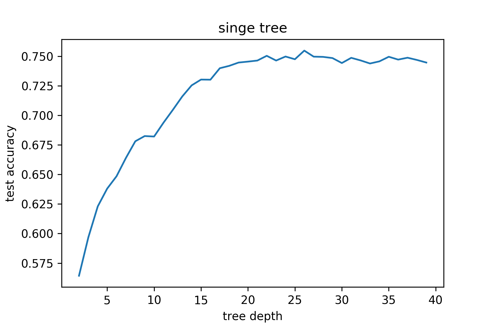
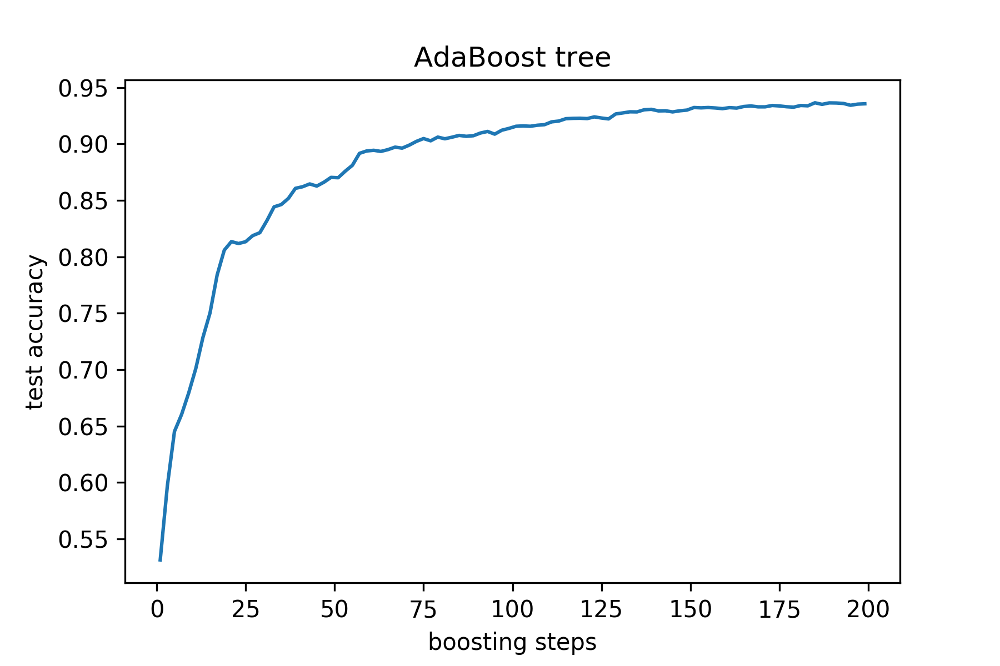
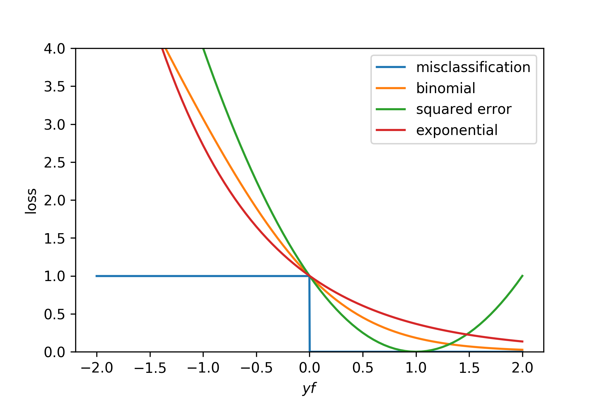
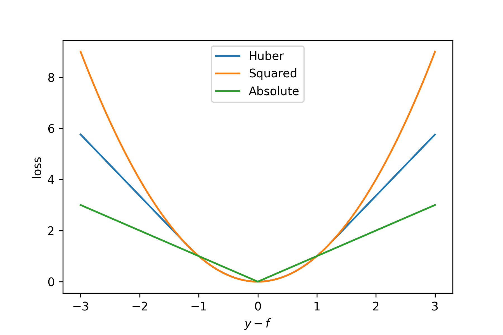
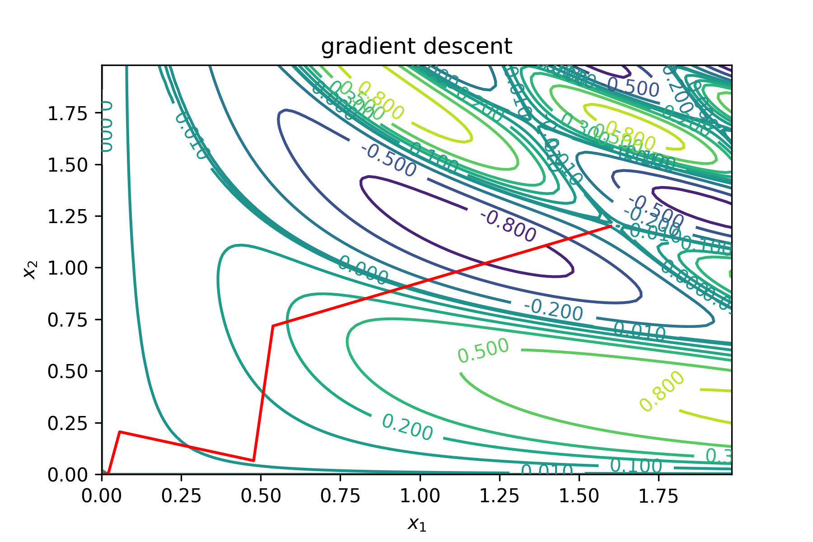

% STK-INF3000/4000
% Week 11
% Ensemble Methods

# Field Trip:
## Regression Algorithms
## for Anomaly Detection
## in Time Series Data

---

## Time series data

- Given $x_i = x(t_i), i=1,\ldots,n$.
    - Quantities measured at a given *time*.
        - E.g. number of users.
        - Bike trips taken.
- Want to predict an $x(t_i)$ in the future.
- Assume that $t_i$ are periodic and equidistant.

---

## Auto-regressive models

- Fit
  $$x(t) \approx \hat f(x(t)) = \hat f(x(t - \Delta_1), \ldots, x(t - \Delta_p))$$
  for chosen shifts $\Delta_k$.
- Need to take into account periodicity in data.
    - E.g. $\Delta_1 = \mbox{1 day}$, $\Delta_2 = \mbox{1 week}$.

---

## Detecting Anomalies

- Predict values using $\hat f$, compare to actuals.
- Let $\delta_i = \hat f(x(t_i)) - x(t_i)$.
    - For an unbiased model, should have $\operatorname{E}[\delta] = 0$.
- Let $\sigma = \sqrt {\frac 1 {N_t} \sum_i(\delta_i - \hat \delta)^2}$.
- Let $z_i = \delta_i / \sigma$.
- Flag data points as anomalous if $z_i > z_{\mbox{max}}$.

---

## Ensemble Methods

---

# Goals

- Reduce over-fitting and increase accuracy by using *multiple*
  models.
    - Reduce variance.
    - Possibly increase bias.
- Most commonly used:
    - Boosting.
    - Bagging.

---

# Boosting

---

## Additive Models

Instead of using one complex predictor, use many instances of a very
basic one $b$ (e.g. a tree with one split).

$$f(x) = \sum_{m = 1}^M \beta_m b(x; \gamma_m)$$

The parameters are given by

$$\min_{\beta, \gamma} \sum_{i = 1}^N L \left( y_i,
\sum_{m = 1}^M\beta_mb(x; \gamma_m)\right).$$

---

### Forward stepwise additive modeling

1. Set $f_0 \equiv 0$.
2. For $m = 1,\ldots,M$
     - Set $$(\beta_m, \gamma_m) = \underset{\beta,
       \gamma}{\operatorname{argmin}} \sum_{i=1}^N L(y_i, f_{m-1}(x_i) +
       \beta b(x_i;\gamma)).$$
     - Set $$f_m(x) = f_{m-1}(x) + \beta_m b(x; \gamma_m).$$
3. Return $f_m$.

---

### FSAM and Square Error loss

For square error loss, we fit in each step to the residuals of the
previous step.

$$\begin{align}
L\left(y_i, f_{m-1}(x_i) + \beta b(x_i;\gamma)\right) &= [y_i - f_{m-1}(x_i) -
\beta b(x_i, \gamma)]^2\\
&= [r_{im} - \beta b(x_i, \gamma)]^2
\end{align}
$$

---

## ADABOOST

Using 

$$L(y, f(x)) = \exp(-y f(x))$$

for targets $y\in\{-1, 1\}$, gives raise to the AdaBoost algorithm.

---

### AdaBoost

1. Initialize $w_i = 1/N,\; i=1,\ldots,N$.
2. For $m = 1, \dots, M$
     - Fit classifier $b_m(x)$ to data with weights $w_i$.
     - Set
       $$ e_m = \frac{\sum_i w_i I(y_i \neq b_m(x_i))}{\sum_i w_i}.$$
     - Set $\alpha_m = \log((1-e_m)/e_m).$
     - Set $w_i \leftarrow w_i \exp[\alpha_m I(y_i \neq b_m(x_i))]$.
3. Return $f(x) = \operatorname{sign}
   \left[\sum_{m=1}^M\alpha_m b_m(x)\right]$.
   
This can be adapted to *regression* as well.

---

### Generated Data

- Taken from Elements of Statistical Learning.
- $X_1, \ldots, X_{10}$ standard Gaussians.
- $$Y = \begin{cases} 1 &\mbox{if } \sum_j X_j^2 > 9.34 =
  \chi_{10}^2(0.5)\\
  -1 &\mbox{else}\end{cases}$$
- 2k training cases, 10k test cases.

---

### Single Tree on Generated Data

---

### AdaBoost on Generated Data

---

## More on Loss Functions

- Let's compare some loss functions for **classification**.
- We'll classify to $\operatorname{sign}(f)$.
- Misclassification: $I(\operatorname{sign}(f) \neq y)$.
- Exponential: $\exp(-yf)$.
- Binomial: $\log(1 + \exp(-2fy))$.
- Squared error: $(y - f)^2$.

---

## Loss functions for classification

---

## Common loss functions for regression

- Squared error, $(f(x) - y)^2$.
- Absolute error, $|f(x) - y|$.
- Huber loss, $$L(f(x), y) = \begin{cases} (y-f(x))^2 &\mbox{if } |y -
  f(x)| \leq \delta\\ 2\delta|y- f(x)| -
  \delta^2&\mbox{else.}\end{cases}$$ 

---

## Loss functions for regression

---

## The ideal loss function

- Robust against outliers.
- Numerically easy.
- Not 'deteriorate'.

---

## The need for gradients.

AdaBoost works great, but we'd like to plug in arbitrary loss
functions. This seems like a hard task looking at

$$\min_{\beta, \gamma} \sum_{i = 1}^N L \left( y_i,
\sum_{m = 1}^M\beta_mb(x; \gamma_m)\right).$$

---

## Gradient boosting.

Using a tree $T$ as our basic model, we build up our model as

$$f_M(x) = \sum_{m=1}^{M} T(x; \gamma_m),$$

where $\gamma_m = \{R_j, c_j\}$ defines the *regions* $R$ of the
terminal nodes and $c_j$ their predictions. We want to find

$$\hat \gamma_m = \underset{\gamma}{\operatorname{agrmin}} \sum_{i =
1}^{N} L( y_i, f_{m-1}(x_i) + T(x; \gamma)).$$

---

## Minimization

In each step, we want to minimize

$$L(f) = \sum_{i=1}^NL(y_i, f(x_i))$$

in order to find

$$\hat{\mathbf{f}} = \underset{\mathbf{f}}{\operatorname{argmin}}L(f).$$

This can be thought of as point-wise optimization.

---

## Gradient Descent

In order to optimize a multi-valued function, gradient descent
constructs a stepwise solution

$$\mathbf{f}_M = \sum_{i = 1}^{M} \mathbf{h}_m,$$

with

$$\begin{align}
h_{im} &= -\alpha_m g_{im} = -\alpha_m \left. \frac{\partial L(y_i,
f(x_i))}{\partial f(x_i)}\right|_{f(x_i) = f_{m-1}(x_i)},\\
\alpha_m &= \underset{\alpha}{\operatorname{argmin}} L(\mathbf{f}_{m-1} -
\alpha \mathbf{g}_m).
\end{align}$$

---

$$f(x_1, x_2) = \sin(x_1^2\,x_2)\cos(2\,x_1\,x_2^2)$$

---

## Gradient boosted trees.

Now use trees to fit at each step

$$\hat \gamma_m = \underset{\gamma}{\operatorname{argmin}}
\sum_{i=1}^N (-g_{im} - T(x_i; \gamma))^2$$

and construct the final model

$$f_M(x) = \sum_{m=1}^{M} T(x; \hat \gamma_m).$$

---

## Regularization

In addition to tuning $M$, one can introduce a parameter $\nu$ and set

$$f_m(x) = f_{m-1}(x) + \nu \sum_{j = 1}^{J}\gamma_{jm} I(x \in
R_{jm})$$.

The number $\nu$ is often called the *learning rate*.

---

# Questions?

