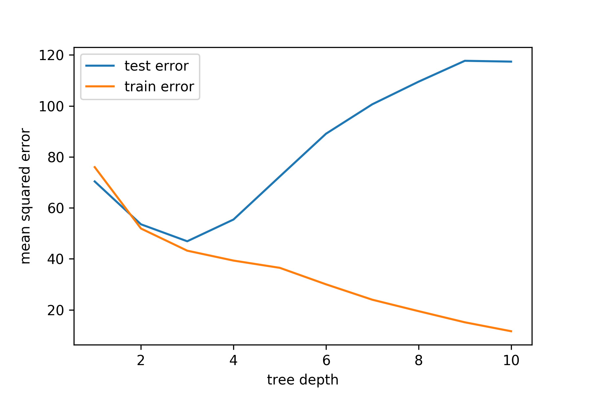

% STK-INF 4000 - Week 12
% Model Evaluation, Random Forests, and Clean Modeling
% Dirk Hesse

$\newcommand{E}[1]{\operatorname{E}\left[#1\right]}
\newcommand{Ex}{\operatorname{E}_{x_0}}
\newcommand{Eo}{\operatorname{E}}
\newcommand{Err}{\operatorname{Err}}
\newcommand{L}{\operatorname{L}}
\newcommand{CT}{\mathcal{T}}
\newcommand{err}{\overline{\operatorname{err}}}$

# Outline

- Model Evaluation.
    - Train error, test error, and all that.
    - Optimism and AIC.
    - Bootstrapping and bagging.
- Random Forests.
- Clean Modeling: Data pipelines.

---

## This Week's Data

### Spambase

[https://archive.ics.uci.edu/ml/datasets/Spambase][sb]

- Classify Emails: *Spam* / *No Spam*
- 4.6k instances.
- 57 features (pre-engineered)
    - freq. of words
	- freq. of characters (e.g. '!')
	- max. capital sequence etc.
- Oldie but goldie (from 1999).
    - Don't use to build spam filters!

[sb]: https://archive.ics.uci.edu/ml/datasets/Spambase

---

## Overfitting - Worst Case

---

## Overfitting - Slightly Less Bad

---

## Training Error

$$\Err_\CT = \E{\L(Y, \hat f(X))| \CT}.$$

$\CT$ is a *fixed* training data set.

---

## Expected Prediction Error

$$\Err = \E{\L(Y, \hat f(X))} = \E{\Err_\CT}.$$

*This* is what we're actually after!

---

## Training Error

$$\err = \frac 1 N \sum_{i=1}^N \L(y_i, \hat f (x_i))).$$

Usually comes for free.

---

## Reminder: Loss Functions

- Continuous data
  $$\L(Y, \hat f(X)) = \begin{cases}
  [Y - f(X)]^2 &\mbox{square loss}\\
  |Y - f(X)| &\mbox{absolute loss}
  \end{cases}$$
- Categorical data
  $$\L(G, \hat G(X)) = \begin{cases}
  I(G \neq \hat G(X)) &\mbox{0-1 loss}\\
  -2 \sum_k I(G = k) \log \hat p_k(X) &\mbox{log odds}
  \end{cases}$$
  
---

## Model selection

- Often we need to tune *hyperparameters*, e.g. tree depth.
- For that we'll use a train-test split.
- Now test data has been *used* for modeling.
- To estimate exp. pred. error, we need fresh data.
    - Do a train-test-**validation** split!

---

## A Closer look at EPE

Assume $\quad Y = f(X) + \epsilon,\quad \E \epsilon = 0,\quad
\operatorname{Var}[\epsilon] = \sigma_\epsilon^2$.

$$\begin{align}
\Err(x_0) &= \E { (Y - f(x_0))^2 | X = x_0}\\
&= \sigma_\epsilon^2 + \left(\E{\hat f(x_0)} - f(x_0)\right)^2
+ \E{ \hat f(x_0) - \E{f(x_0)}}^2\\
&= \sigma_\epsilon^2 + \mbox{Bias}^2 + \mbox{Variance}
\end{align}$$

---

### Bias in Linear Models

One finds for linear models

$$\begin{align}
\Ex \left(f(x_0) - \E{\hat f_\alpha(x_0)}\right)^2 =&\; \Ex
\left(f(x_0) - x_0^T\beta_*\right)^2 \\&+ \Ex \left( x_0^T \beta_* - \E
{x_0^T \hat \beta_\alpha}\right)^2\\
=&\; \mbox{model bias}^2 \\
&+ \mbox{estimation bias}^2
\end{align}$$

---

### Types of Bias

- Model bias
    - How well can the model *in principle* fit $f$?
- Estimation bias
    - How well can we determine the *model parameters*?

---

## Optimism

Assume we observe $N$ new *response* values at each of the training
points $x_i$. Define the *in-sample* error as

$$\Err_\mathrm{in} = \frac 1 N \sum_{i=1}^N \Eo_{Y^0} \left[ L(Y_0, \hat
f (x_i)|\CT \right].$$

The *optimism* is $\operatorname{op} = \Err_\mathrm{in}$.

---

## A Closer Look at the Generalization Error

$$\begin{align}
\Eo_y[\Err_\mathrm{in}] &= \Eo_y [\err] + \frac 2 N \sum_{i=0}^N
\operatorname{Cov}(\hat y_i, y_i)\\
&\overset{Y = f(X) + \epsilon}= \Eo_y [\err] + 2 \frac d N \sigma_\epsilon^2.
\end{align}$$

$d$ is the effective dimension of the model.

---

### Akaike Information Criterion

Assume we have a tuning parameter $\alpha$. Define

$$\operatorname{AIC}(\alpha) = \err(\alpha) + 2 \frac {d(\alpha)} N
\hat \sigma_\epsilon^2.$$

Now calculate $\operatorname{AIC}$ for a range of $\alpha$ and choose
the one minimizing $\operatorname{AIC}$.

---

## Calculating the Effective Dimension

How to get $d(\alpha)$?

- Linear models: $\hat y = S y$.
    - Then $\operatorname{df}(S) = \operatorname{trace}(S)$.
- More generally $\operatorname{df}(\hat y) = \frac{\sum_i \operatorname
  {Cov}(\hat y_i, y_i)}{\sigma_\epsilon^2}$.

---

## Cross Validation

- Estimates $\Err = \E{\L(Y, \hat f(X))}$.
- Doesn't do a good job for $\Err_\CT$.
- Good for situations with scarce data.

---

## Definition of CV

- Ingredients
    - $N$ training points.
    - Number of folds $K$ (often 5 or 10).
    - Indexing function $\kappa: \{1,\ldots, N\} \rightarrow \{1,
      \ldots, K\}$.
	- $K$ fits, s.t. $f^{-k}$ is fitted **without** the points $x_i,
      y_i$ where $\kappa(i) = k$.

$$\operatorname{CV}(\hat f) = \frac 1 N \sum_{i = 0}^N \L (y_i, \hat f^{-\kappa(i)}(x_i)).$$

---

## How to choose K?

The choice of $K$ depends on the number of training examples available
and needed.

---

## A Word Warning

- Cross validation **must** be applied to **all** modeling steps.
    - In particular to feature selection.
- We'll see an example of this later!
- Exception: Unsupervised modeling/pre-processing steps.

---

## Bootstrapping

- Given a training set $Z = (z_1, \ldots, z_N)$.
- Generate $B$ new training sets $Z^{*b}$ of size $N$.
    - By sampling with replacement from $Z$.
- One can now estimate any aspect of the distr. of $S(Z)$
    - E.g. $\operatorname{Var}[S(Z)] = \frac 1 {B - 1} \sum_{b=1}^B
      \left(S(Z^{*b}) - \overline S^*\right)^2$.
	- Where $\overline S^* = \frac 1 B \sum_b S(Z^{*b})$.
