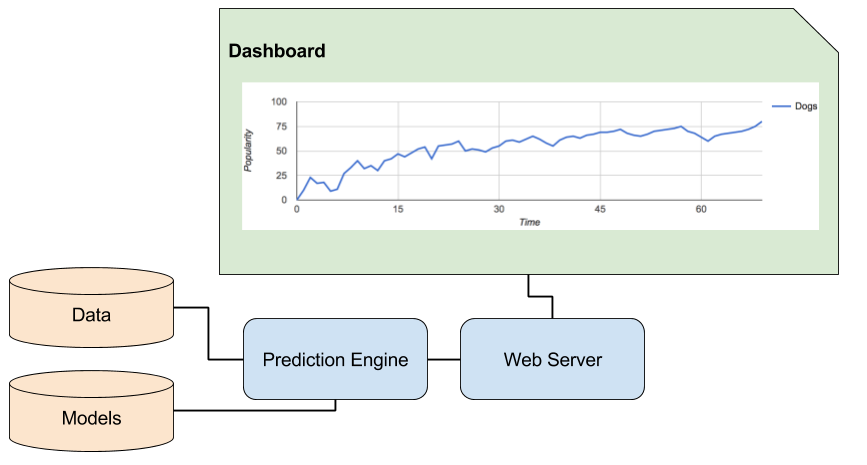

% STK-INF4000 - Week 15
% Presenting Results using Javascript and Flask
% Dirk Hesse

# How do you present your findings?

- Sometimes a PDF or presentation is okay.
- Generally fast throughput is needed.
    - Enter: Dashboards.

---

## Anatomy of a Dashboard?

---

## How to Make a Dashboard

- Lots of off-the-shelf products.
    - Still needs your prediction engine.
        - Off-the shelf solutions available.
        - ... but often**expensive**, and not that simple ...
- Hack your own.
    - Don't reinvent the wheel!

---

## What we'll Use.

- Web Server: [Flask][flask]
- Presentation: HTML + Javascript + [Google Charts][gc]

[flask]: http://flask.pocoo.org/
[gc]: https://developers.google.com/chart/

---

## Step 1: Let's learn some Javascript

- Why?
    - Javascript **drives** the web.
	- Used by almost all websites (95%).
	- Preferred way to make sites dynamic.
	- Opens the door to use cool libraries, e.g. vue.js, angular.js,
      ...

---

## Step 2: Let's make a web server

---

## Step 3: Let's use google charts to put things together.
