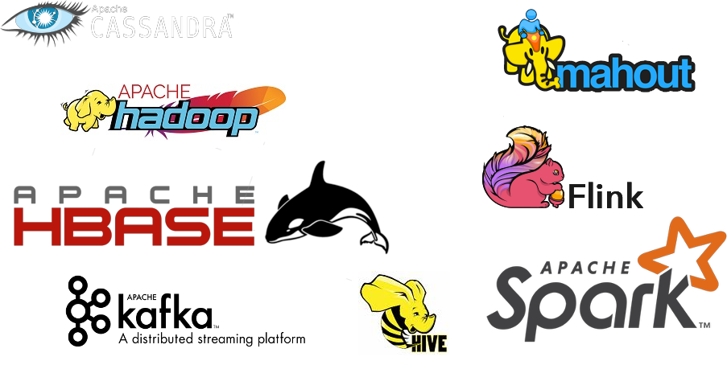
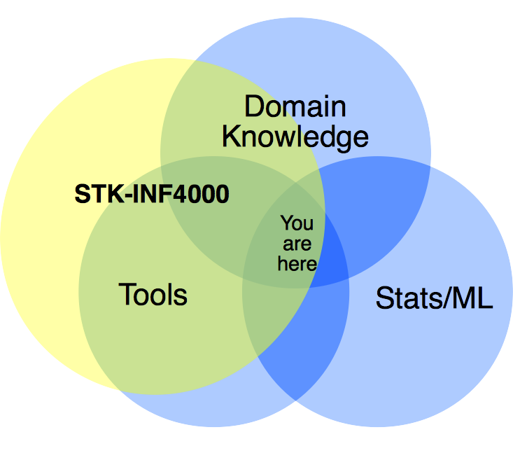

% STK-INF 4000 - Week 16
% Leftovers & Recap
% Dirk Hesse

# Google's Rules of ML

Source: [http://martin.zinkevich.org/rules_of_ml/rules_of_ml.pdf](http://martin.zinkevich.org/rules_of_ml/rules_of_ml.pdf).

0. Before Machine Learning
1. ML Phase 1: Your First Pipeline
2. ML Phase 2: Feature Engineering
3. ML Phase 3: Slowed Growth, Optimization Refinement, and Complex
   Models

---

# Before ML

- Don't be afraid **not** to use ML!
    - Heuristics might work well.
    - You might not have enough data for ML.
- Design and implement metrics first.
    - Easier to get user consent early.
    - Start collecting data early.
    - Better system design if data collection built in.
    - Notice what changes and what doesn't.
- Prefer ML over complex heuristics.

---

# ML Phase 1: Your First Pipeline

- Focus on infrastructure first.
    - Keep models simple.
    - Think about integration of ML part into system.
    - Use simple features.
- Test infrastructure independent from model.
- Be careful when copying pipelines.
    - E.g. dropping historical data.
- Re-use heuristics.
    - Preprocessing.
        - E.g. drop blacklisted domains.
    - Use heuristic as features.
    - Use heuristic's inputs as features.
    - Modify feature using heuristic.

---

## Monitoring

- How often do we need to re-train?
- Test models before exporting.
    - Don't export models with e.g. bad AUC.
- Beware of silent failures.
    - E.g. input table not getting updated.
- Document features.
- Make people responsible for features.

---

## Your first Objective

- Don't overthink your fist choice of *objective*.
- Choose a simple and observable metric as first objective.
    - Good
        - Did the user click?
        - Did the company go bankrupt?
    - Maybe not at first
        - Did the user come back the next day?
        - How long did the user visit?
    - Bad
        - Is the user happy?
- Start with interpretable models.
- Don't combine tasks.
    - E.g. quality ranking + spam filtering.

---

## Phase 2: Feature Engineering

- Plan for iterations.
    - Don't be afraid to launch a model that's *just* good enough.
    - Don't be afraid to spend a little time on a model.
- Don't start out with learned features.
    - E.g. clustering, deep learning.
- Prefer features that are generic.
    - E.g. 'like count' makes *only* sense for older Tweets.
- Don't be afraid of features only applying to few cases.
    - If you have enough data.
    - Can use regularization to remove too specific features.
- Combine and modify features.
    - E.g. discretization, cross-products.
- Rule of thumb for linear models: $d = O(N)$.
    - Of course, provided enough computing power.
- Clean up you feature space.
    - Unused features incur costs!

---

## Human Analysis

- Beware of you biases!
- Measure difference between models.
- Utility is more important than predictive power.
    - What do you use or model for?
    - How good is it at that.
    - If they diverge, re-think model objective.
- Look for patterns in errors.
    - Create features to overcome them.
- Quantify any issues with the model.
    - First measure, then optimize.
- Same short term behavior $\neq$ same long-term behavior.

---

## Training Serving Skew

- Why?
    - Differences in pipelines.
    - Difference in data patterns at serving time.
    - Feedback loops.
- Save serving data + outcomes for later training.
- Sample and weight, don't drop data.
- Beware of changing external factors.
    - E.g. table with weather data.
- Re-use code as much as possible.

---

## Training Serving Skew

- Choose test data for time series data with care!
    - Don't just leave data out randomly.
- Take care when using binary classification for filtering.
    - False positives can't be used for training straight-forwardly.
    - Better: Hold out e.g. 1% of data an let it all pass.
- Ranking = Skew
- Beware of feedback.
    - E.g. higher rank $\rightarrow$ more clicks.
- Measure skew.

---

## Phase 3: Refinement

- Check if you're still optimizing the right thing.
    - Even great features won't save you if you don't!
- Keep the big picture in mind.
- Don't be afraid of ensembles.
    - But keep them simple!
- When performance plateaus, look for new data sources.
    - Don't waste too much time on refining models.
- Personalization $\neq$ popularity!
- Personalization $\neq$ personalization!
    - People have same peer group across platforms. Not necessarily
      same tastes.

---

# What We have Learned...

---

# Moore's Law

---

# Tools

---

# Tools ... aren't everything

---

# The Idea

---

# Python

- Lists
    - Utility Functions
    - List comprehensions
    - Element access
    - Combining lists
- Tuples
- Strings
- `for` loops
    - `for`-`else`
- `while` loops
- Reading data
- Lambdas
- Plotting basics

---

# More Python

- Functions
    - Default arguments
	- `*vargs`, `**kwargs`
- Dictionaries
    - Utility Functions
    - Element access
    - Dict comprehensions
    - `defaultdict`, `Counter`
- Decorators
- Objects
    - Methods
    - Inheritance
- JSON

---

# Web scraping

- Scrapy
- Beautifulsoup

---

# Testing & IO

- Unittests
    - What can & can't be tested?
- REST APIs
- Twitter
    - Search API
	- Streaming API
	- Authentication
- MongoDB
    - Storing
    - Retrieving
    - Modifying
    - Aggregation

---

# Machine Learning

- Intro
    - Data, input, target.
    - Learning task
    - Types of data
    - Supervised & Unsupervised learning
- Basic probability
    - Expectation values
    - Probability distributions
    - Conditional probability
- Decision theory
    - $f(x) = \operatorname E(Y | X = x)$.
    - Loss function.
- K-Nearest neighbors
    - Bias-variance tradeoff

---

# Pandas

- Series
- Index
- Arithmetic
- Data Frames
- Aggregation
- Pivot/Stack
- Reading data
- Plotting

---

# Linear Regression

- Linear approximation
- Confidence intervals on parameters
- z-Score
- F statistic
- In Python
    - Pure Numpy
    - Scikit-Learn
    - Statsmodels

---

# Variable Selection

- All subsets
- Forward/backward step-wise
- Shrinkage methods
    - Lasso
    - Ridge regression
    - Elastic net
	
---

# Big(er) Data Quantities

- What is big?
- Inner workings of a computer.
- Storage
    - Latency
    - Bandwidth
    - Size
- CPU speeds
- Clusters

---

# Map Reduce

- By hand.
- Spark.
    - RDDs
    	- map, reduce, take, aggregate, (-by key), ...
    - Reading data

---

# Classification

- Decision boundaries.
- Linear classification.
- Discriminant function.
- Categorical inputs.
- Linear/Quadratic Discriminant Analysis.
    - Regularization.
- Logistic regression.
- Objectives
    - False/true positives/negatives
    - Sensitivity, Specificity, Precision, Accuracy.
    - ROC, AUC 
- Cover type data set.
- Wine quality data set.

---

# Classification in Spark

- The Spark Data Frame.
    - Operations
	- Creating
    - Selecting data
    - Schema
- Spark ML

---

# Anomaly Detection

- Rule-based systems.
- Outliers, z-score, Chebychev's inequality.
- Clustering
    - Objective, distance functions, Linkage.
    - Hierarchical clustering.
        - Divisive vs. agglomerative.
	- K-Means and others.
    - Knee method and inertia
- Clustering for fraud detection.

---

# Clustering in Spark

- Data frames.
    - Collecting features.
    - Exporting to pandas.
- Clustering in Spark ML

---

# Trees

- Calculating trees.
    - Stopping criteria.
- Regression and classification trees.
- Trees vs. regression.
- Bias-Variance trade-off, again.
    - Train-test split.
- Split functions
	- Misclassification: $1 - \hat p_{mk(m)}$.
	- Gini index: $\sum_{k=1}^K \hat p_{mk}(1 - \hat p_{mk})$.
	- Cross-entropy: $-\sum_{k = 1}^K \hat p_{mk} \log \hat p_{mk}$.
- Loss matrix.

---

# Ensembles and Boosting

- Forward step-wise additive modeling.
- Adaboost.
- Loss functions
    - Classification
        - Misclassification: $I(\operatorname{sign}(f) \neq y)$.
        - Exponential: $\exp(-yf)$.
        - Binomial: $\log(1 + \exp(-2fy))$.
        - Squared error: $(y - f)^2$.
    - Regression
  	    - Squared error, $(f(x) - y)^2$.
        - Absolute error, $|f(x) - y|$.
        - Huber loss, $$L(f(x), y) = \begin{cases} (y-f(x))^2 &\mbox{if } |y -
                f(x)| \leq \delta\\ 2\delta|y- f(x)| -
                \delta^2&\mbox{else.}\end{cases}$$ 

---

# Gradient boosting

- Gradient descent.
- Fitting gradient descent with trees.
- Advantages:
    - Can use most loss functions.
    - Can use regularization.

---

# Time series

- ARMA models.
- For outlier detection.

---

# Model Evalutation

- Test error.
- Expected prediction error.
- Training error.
- Hyperparameters.
- Closer look at the bias.
    - Model bias
    - Estimation bias
- Generalization error, Akaike IC
- Cross Validation
    - How many folds?
- Bootstrapping.
- Bagging.
- Random forests.

---

# Pipelines

- In Spark.
- In Sklearn.
- Including validation.
- Parameter tuning in pipelines.

---

# NLP Field Trip

- Types of NLP tasks.
- Regular expressions.
- Tokenization.
- Normalization.
    - Stemming.
    - Lemmatization.
- Language models.
    - Markov assumption.
    - N-Gram models.
    - Calculating N-Gram probabilities.
- Text classification.
    - Naïve Bayes.

---

# Presenting Results

- Flask.
- Javascript.
    - Google charts.

---

# What's missing?

---

# Support Vector Machines

---

# Neural Networks

---

# The Cloud

- AWS
- Google Cloud
- Azure
- Bluemix

---

# Where to go From Here?

- NLP
- Deep Learning
- Machine Learning
- Summer Jobs
- Master Thesis in Industry

---

# Final Presentation

- Don't forget an introduction!
    - What's your goal?
	- What's the main idea?
- Have you solved you original problem?
    - If not, where are you?
	- Is this enough for some intermediate goal?
- Practical issues.
    - Pipelines.
    - Will you need to scale (Spark)?
- Show what you've done since last time.

---

# Your feedback

[http://tinyurl.com/STKINF](http://tinyurl.com/STKINF)

[https://goo.gl/forms/vSRMO7MxTABx1Siy1](https://goo.gl/forms/vSRMO7MxTABx1Siy1)
