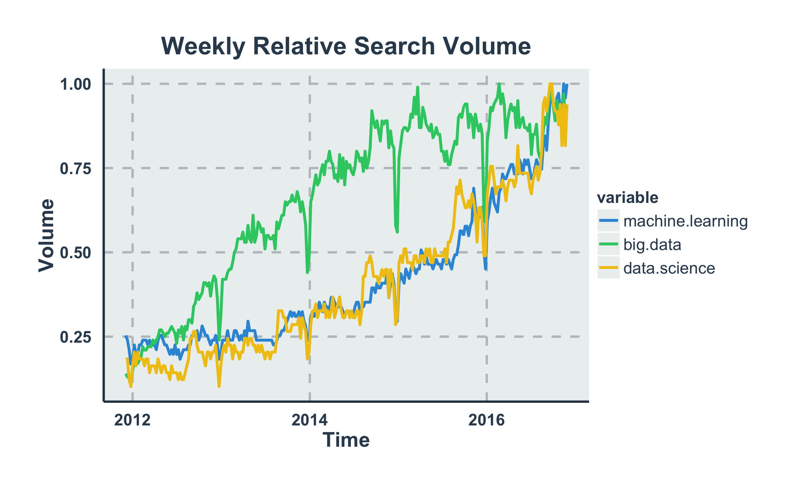
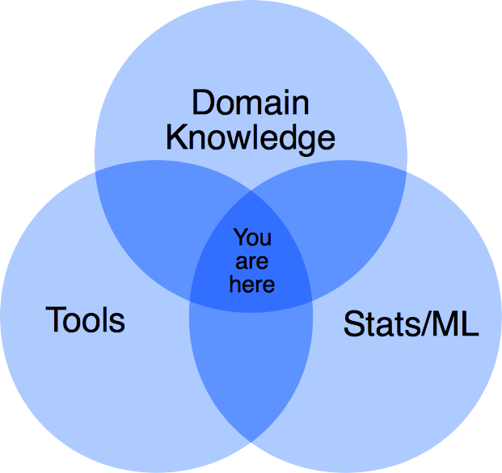
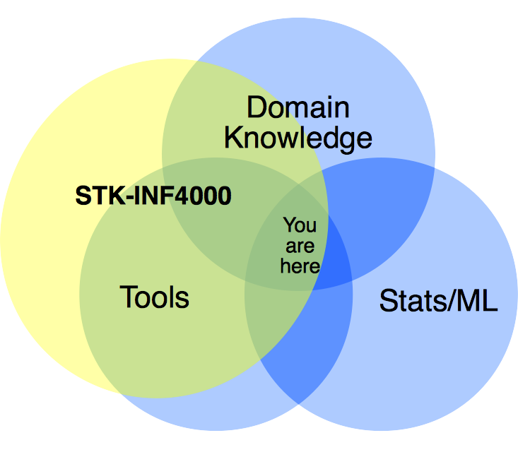

% STK-INF4000
% Selected Topics in Data Science
% Dirk Hesse

# Why A Data Science Lecture?

---

# Data Science?

---

# The Idea

---

# What You'll Lern

- Tools.
- Entrepreneurial thinking.
- Some Machine Learning / Stats where needed.

---

# Tools

**... really too many to list ...**

- Spark
- MonogDB
- REST APIs (Facebook, Tiwtter, ...)
- Python (where needed)
- Scikit-Learn
- Matplotlib
- Cloud Platforms (e.g. AWS)
- Data wrangling ...

---

# There will be lots of data!

- Homework / Exercises.
- Project work.

---

# Entrepreneurial thinking ...

- Think of a data project.
- Plan the project.
- Code the project.
- Pitch the project (part of final exam).

---

# Machine Learning / Stats

- I'm *not* a statistician.
- The course it *not* primarily about ML.
- However ...
    - ML is *essential* for data projects.
    - I'll explain techniques / algorithms where needed.
    - It'll probably be needed.

---

# Questions?

<code>herr.dirk.hesse@gmail.com</code>

---

# Backup Slides

---

# Books

### There are no books ...

---

### ... however ....

- [An Introduction to Statistical Learning][isl] *Gareth James et al.*
- [Dive Into Python][dip] *Mark Pilgrim*
- [Spark Quickstart][sqs] *Spark Website*
- [Spark Programming Guide][spg] *Spark Website*
- [Mining of Massive Datasets][mom] *Jure Leskovec et al.*

[isl]: http://www-bcf.usc.edu/~gareth/ISL/
[dip]: http://www.diveintopython.net/
[sqs]: http://spark.apache.org/docs/latest/quick-start.html
[spg]: http://spark.apache.org/docs/latest/programming-guide.html
[mom]: http://www.mmds.org/
